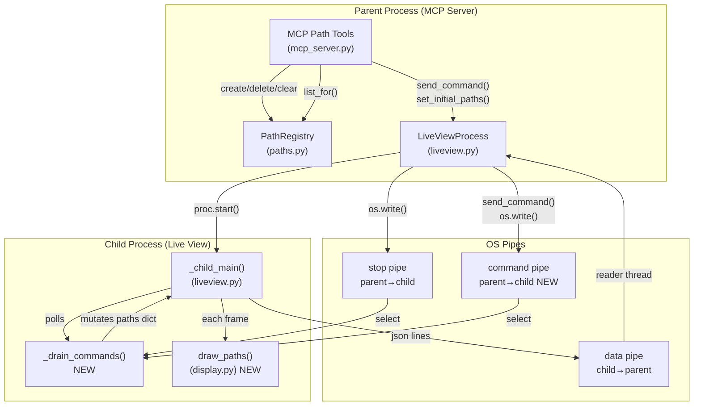
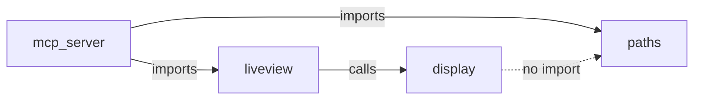

<!-- CLASI: Before changing code or making plans, review the SE process in CLAUDE.md -->

# Architecture Update -- Sprint 001: Agent-Drawn Paths on the Live View

## Step 1: Problem Understanding

Agents can read the AprilCam playfield but cannot annotate it. This sprint
adds a round-trip path annotation capability:

- Agent submits a path (list of waypoints in world cm) via MCP.
- The MCP server stores the path in a registry (parent-process memory).
- If a live view is running, the path is forwarded via a new OS pipe to the
  child process.
- The child renders the path each frame using OpenCV primitives, with
  per-waypoint symbol scaling tied to the physical playfield.
- Paths survive live-view restarts via an initial-state push at child startup.

The existing codebase has two OS pipes (data: child→parent; stop: parent→child).
This sprint adds a third pipe (commands: parent→child) and a new drawing method.
No existing interfaces are broken; all changes are additive within their modules.

## Step 2: Responsibilities

**New responsibilities introduced by this sprint:**

1. **Path data ownership** — store, create, delete, list, and clear paths
   keyed by `playfield_id`. Enforce monotonic IDs. Thread-safe.

2. **MCP surface for paths** — expose four tools (`create_path`,
   `delete_path`, `list_paths`, `clear_paths`) with full input validation
   matching the existing FastMCP tool shape.

3. **Playfield→live-view lookup** — given a `playfield_id`, find the
   `LiveViewProcess` (if any) running on that playfield's camera, so MCP
   tools can forward commands without coupling to camera internals.

4. **Cross-process path delivery** — forward path mutations (add / remove /
   clear) to the live-view child in real time via a line-delimited JSON pipe.
   Deliver initial state before child startup to handle restart.

5. **Path rendering** — map world-cm waypoints through inverse homography and
   display-space transform; draw lines and 8 symbol types with per-waypoint
   pixel-radius scaling.

**Responsibilities that do not change:** camera management, frame capture,
tag detection loop, ring buffer, playfield calibration, existing display
overlays, CLI entry point.

## Step 3: Modules

### Module: paths registry (`src/aprilcam/server/paths.py`)

**Purpose:** Owns all path data for the server process.

**Boundary (inside):** `Symbol` type alias, `RGB` type alias, `Waypoint`
frozen dataclass, `Path` dataclass with `to_dict()`, `PathRegistry` with
`create`, `delete`, `get`, `list_for`, `clear_for` methods and a
thread-safe lock.

**Boundary (outside):** Does not import from `liveview`, `display`, or
`mcp_server`. Has no OpenCV dependency. Pure Python + dataclasses.

**Use cases served:** SUC-001, SUC-002, SUC-003, SUC-004, SUC-006.

### Module: MCP path tools (additions to `src/aprilcam/server/mcp_server.py`)

**Purpose:** Exposes path CRUD to agents and coordinates pipe delivery.

**Boundary (inside):** `_live_view_for_playfield(playfield_id)` helper;
`_handle_create_path`, `_handle_delete_path`, `_handle_list_paths`,
`_handle_clear_paths` functions; four `@server.tool()` wrappers; import
of `paths` module and instantiation of `path_registry = PathRegistry()`.
Also: initial-state push inside `_handle_start_live_view` before
`proc.start()`.

**Boundary (outside):** Calls `path_registry` (paths module) and
`LiveViewProcess.send_command()` / `set_initial_paths()` (liveview module).
Does not import `display`. Validation is done here before touching the
registry.

**Use cases served:** SUC-001, SUC-002, SUC-003, SUC-004, SUC-006.

### Module: command-pipe IPC (additions to `src/aprilcam/ui/liveview.py`)

**Purpose:** Delivers path mutations from parent to child in real time and
seeds initial state at child startup.

**Boundary (inside):** Third OS pipe (`cmd_r`, `cmd_w`) created in
`LiveViewProcess.start()`; `set_initial_paths(paths)` setter called before
`proc.start()`; `send_command(msg)` writes a JSON line to `cmd_w`.
In the child: `cmd_fd` and `initial_paths_json` added to `_child_main`
signature; `cmd_in = os.fdopen(cmd_fd, "r")`; `paths: dict[str, dict]`
seeded from `initial_paths_json`; `_drain_commands()` replaces
`_should_stop()` — uses `select.select` on both `stop_in` and `cmd_in`,
mutates `paths` dict, returns True only on stop signal; `cmd_in.close()`
in `finally`.

**Boundary (outside):** Child does not import `Path` dataclass or `paths`
module — consumes plain dicts that arrived over the pipe. Parent side
calls `display.draw_paths()` indirectly (child calls it in its render loop).

**Use cases served:** SUC-001, SUC-002, SUC-004, SUC-005, SUC-006.

### Module: path drawing (addition to `src/aprilcam/ui/display.py`)

**Purpose:** Renders waypoint paths onto a display frame each iteration.

**Boundary (inside):** New method `PlayfieldDisplay.draw_paths(frame,
paths, playfield, homography)`. Accepts plain `dict` entries (not
dataclasses) to avoid cross-process import coupling. Performs:
world-cm → source-pixel (inverse homography), source-pixel → display-pixel
(`_map_points_to_display`), per-waypoint pixel-radius scaling, lines-then-
symbols draw order, RGB→BGR color conversion at the `cv.*` call boundary.
All 8 symbols implemented.

**Boundary (outside):** No-op if `homography` is `None` (uncalibrated
playfield). No imports added beyond what `display.py` already uses
(`cv2`, `numpy`). Does not call back into `mcp_server` or `paths`.

**Use cases served:** SUC-005.

## Step 4: Diagrams

### Component Diagram — Parent/Child Split with Three Pipes

### Module Dependency Graph

Dependency direction: `mcp_server` (API layer) → `paths` and `liveview`
(domain/infrastructure) → `display` (rendering). No cycles.

## Step 5: Document

### What Changed

| Component | Change |
|-----------|--------|
| `src/aprilcam/server/paths.py` | **New file.** `Symbol`, `RGB`, `Waypoint`, `Path`, `PathRegistry`. |
| `src/aprilcam/server/mcp_server.py` | Added `path_registry` instance, `_live_view_for_playfield()` helper, four MCP tool handlers and `@server.tool()` wrappers, initial-state push in `_handle_start_live_view`. |
| `src/aprilcam/ui/liveview.py` | Added third OS pipe; `set_initial_paths()` and `send_command()` on `LiveViewProcess`; `cmd_fd` and `initial_paths_json` params to `_child_main`; `_drain_commands()` replacing `_should_stop()`; `draw_paths()` call in render loop; `cmd_in.close()` in finally. |
| `src/aprilcam/ui/display.py` | Added `draw_paths()` method to `PlayfieldDisplay`. |
| `pyproject.toml` | Version bumped to `0.20260514.1`. |

### Why

Agents need to annotate the live playfield display with planned routes.
The path registry enables persistent, playfield-scoped path storage in the
server process. The command pipe lets the running child receive mutations
without polling shared memory or restarting. Initial-state push ensures
restarts are seamless.

### Impact on Existing Components

- `_child_main` gains two new parameters (`cmd_fd`, `initial_paths_json`).
  The call site in `LiveViewProcess.start()` is the only caller — no other
  code invokes `_child_main` directly. Not a public API.
- `_should_stop()` (a nested function inside `_child_main`) is replaced
  by `_drain_commands()`. The replacement returns the same boolean stop
  signal and adds the command-drain side effect; the loop call site changes
  from `_should_stop()` to `_drain_commands()`.
- `draw_overlays()` call in `_child_main` is unchanged; `draw_paths()` is
  inserted after it. The draw order (overlays first, paths on top) is
  intentional.
- No existing MCP tools are modified or removed.
- `LiveViewProcess.stop()` gains one new fd to close (`_cmd_write_fd`).

### Migration Concerns

None. All changes are additive. The new pipe is created and closed within
`LiveViewProcess.start()` / `stop()`. No persistent storage, no schema
migration, no breaking changes to existing MCP tools or CLI.

## Step 6: Design Rationale

### Decision: Line-delimited JSON over the command pipe (not shared memory or queues)

**Context:** The child runs in a separate process; existing IPC uses OS pipes
with line-delimited text.

**Alternatives considered:**
- `multiprocessing.Queue` — requires pickling and a manager process; adds
  complexity and a new process-startup dependency.
- Shared `multiprocessing.dict` — requires a manager process; GIL doesn't
  protect cross-process access without locks.
- File-based state — polling delay; filesystem coupling.

**Why this choice:** Consistent with the existing stop pipe pattern.
`select.select` on two pipe fds is a single syscall; no threads added to
the child. Line-delimited JSON is human-readable, debuggable, and matches
the data pipe already in use.

**Consequences:** Pipe buffer is bounded (~64 KB on macOS/Linux). Each
command is one JSON line; individual lines are small (< 4 KB for any
reasonable path). Buffer overflow is not a practical concern for path
operations. Pipe is one-directional (parent→child only); no back-pressure.

### Decision: Child consumes plain dicts, not `Path` dataclasses

**Context:** The child is a separate process that does not need the full
`paths` module.

**Why this choice:** Avoids importing `mcp_server`-side modules in the
child (no circular import risk). Keeps the child's import footprint small.
The dict schema is stable (defined by `Path.to_dict()`); no type safety
needed across a process boundary.

**Consequences:** If `Path.to_dict()` schema changes, the child's rendering
logic must be updated in sync — a minor coupling that is manageable given
both sides are in the same repository.

### Decision: RGB→BGR conversion at the `cv.*` call boundary

**Context:** Colors are specified by agents in RGB (natural for web/UI).
OpenCV uses BGR internally.

**Why this choice:** Keeps the API surface and registry in RGB (agent-facing
coordinates). A single `color[::-1]` flip at the draw site is explicit and
local. No conversion leaks into the data model or IPC protocol.

**Consequences:** Every `cv.circle`, `cv.rectangle`, etc. call in
`draw_paths` must remember to flip. The `draw_overlays` method uses BGR
constants (already written as `(B, G, R)` tuples) — developers must not
mix conventions.

### Decision: Per-waypoint `size_cm` scaled via a second world point

**Context:** Symbols must read as physically correct sizes regardless of
camera angle or zoom.

**Why this choice:** Mapping `(x + size_cm/2, y)` through the same
homography pipeline as `(x, y)` and taking the pixel distance gives a
correct display radius in all cases — perspective, deskew, and crop modes.
Alternative (fixed pixel radius per cm) fails when camera angle or zoom
changes.

**Consequences:** Two homography + display-map calls per waypoint instead
of one. Cost is negligible at 30 fps with typical path sizes (< 20
waypoints).

## Step 7: Open Questions

None. The issue file is comprehensive and resolves all design decisions.
The only documented limitation (homography snapshotted at child startup;
post-startup calibration does not affect running view) is a pre-existing
constraint explicitly accepted in the issue file.
