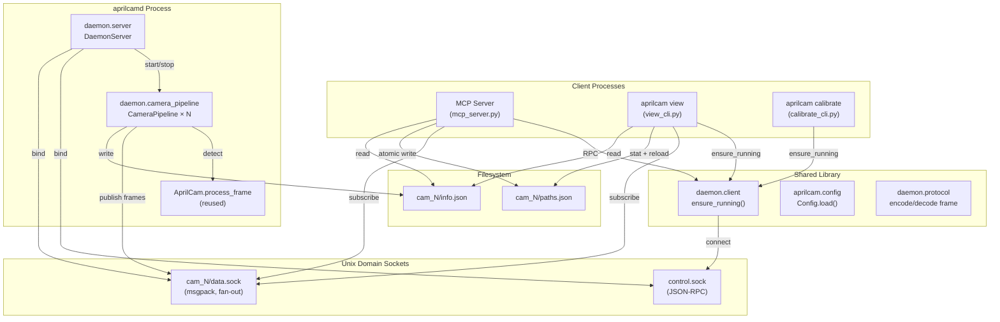
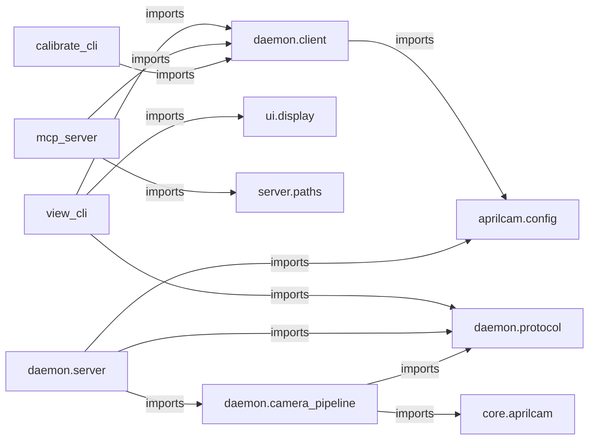
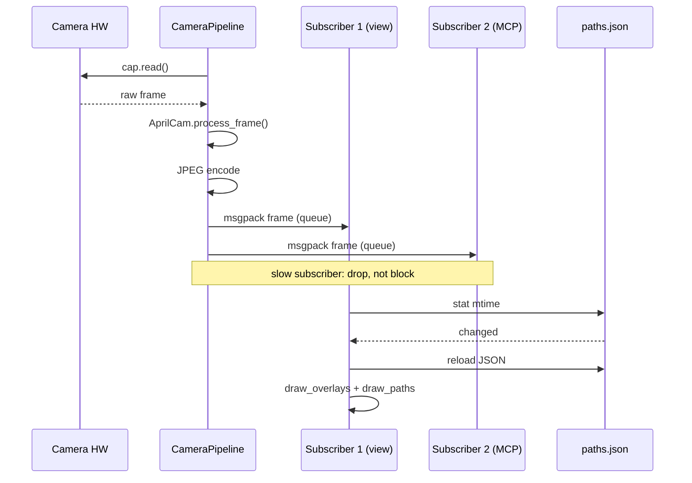

<!-- CLASI: Before changing code or making plans, review the SE process in CLAUDE.md -->

# Architecture Update -- Sprint 002: AprilCam Daemon Architecture

## Step 1: Problem Understanding

Sprint 001 established path data ownership (`PathRegistry`, `paths.py`) and
drew paths on a live-view child process via a new OS pipe. The camera was
still opened directly by whichever process claimed it first — the MCP server,
the live-view child (inside `liveview.py`), or the calibration CLI. On macOS
AVFoundation this is exclusive: two opens fight and one loses. Sprint 001
deferred the final manual verification (ticket T005) because a standalone
`aprilcam view` window and the MCP server could not share the camera.

This sprint reorganizes the entire runtime around a single daemon process
(`aprilcamd`) that is the only code path that ever calls `cv.VideoCapture`.
All other processes become stateless consumers that connect to Unix domain
sockets the daemon publishes. The sprint also replaces the OS-pipe IPC with a
file-based paths mechanism, deletes `liveview.py` entirely, and introduces a
new `aprilcam view` CLI and a full config loader.

## Step 2: Responsibilities

**New responsibilities:**

1. **Daemon lifetime management** — Single long-running supervisor owns the
   control socket, handles the pidfile/flock, manages per-camera pipeline
   threads, and responds to control RPCs.

2. **Per-camera frame pipeline** — Capture + detect + JPEG-encode + fan-out.
   One thread per camera. Reuses existing `AprilCam.process_frame`.

3. **Frame message protocol** — Define and encode the per-frame msgpack
   message schema; decode on the consumer side. Length-prefixed framing.

4. **Client shared helper** — `ensure_running(config)` used by every entry
   point (MCP server, view CLI, calibrate CLI) to auto-spawn the daemon if
   not present, with a flock-protected spawn lock to prevent races.

5. **Live viewer** — Stateless subscriber that connects to the data socket,
   decodes frames, stats/reloads the paths file on mtime change, and renders
   overlays client-side using existing `PlayfieldDisplay.draw_overlays` and
   `draw_paths`.

6. **Configuration loading** — Multi-source config chain
   (`~/.aprilcam` → project-local `.aprilcam` → `.env` → env vars), exposing
   a `Config` dataclass consumed by all entry points.

7. **Paths-file write side effect** — MCP path tools atomically rewrite
   `paths.json` on every mutation; viewers reload on mtime change. Replaces
   the OS-pipe `send_command` side effect from sprint 001.

**Responsibilities removed:**

- OS-pipe IPC (`LiveViewProcess`, `_child_main`, `_drain_commands`, command
  pipe) — the entire `liveview.py` parent-child pipe architecture is deleted.
- Direct `cv.VideoCapture` calls in `mcp_server.py`, `calibrate_cli.py`, and
  any other client — moved exclusively into the daemon.

**Responsibilities that do not change:**

- Path data model (`PathRegistry`, `Waypoint`, `Path` in `paths.py`).
- Tag detection and frame processing (`AprilCam.process_frame`).
- Playfield homography (`PlayfieldBoundary`).
- Overlay drawing (`PlayfieldDisplay.draw_overlays`, `draw_paths`).
- MCP path tools (`create_path`, `delete_path`, `list_paths`, `clear_paths`) —
  input, validation, and registry logic unchanged; only the side effect changes.
- Ring buffer for tag history (`RingBuffer`) — moves into the daemon pipeline.
- Calibration math — unchanged; only the camera-acquisition path changes.

## Step 3: Modules

### Module: `aprilcam.config` (extended)

**Purpose:** Loads and exposes all runtime configuration from a priority-ordered
chain of dotfiles and environment variables.

**Boundary (inside):** `Config` dataclass with fields for
`APRILCAM_DATA_DIR`, `APRILCAM_SOCKET_DIR`, `APRILCAM_CALIBRATION_SOURCE`,
`APRILCAM_CALIBRATION_SAVE_PATH`, `APRILCAM_LOG_LEVEL`,
`APRILCAM_DAEMON_PIDFILE`; `Config.load()` classmethod that walks the config
chain; helper `_find_dotfile()` for walking up from cwd.

**Boundary (outside):** Does not open cameras, sockets, or files other than
the config sources themselves. Does not depend on OpenCV or any AprilCam
domain module. Pure stdlib + python-dotenv. The existing `AppConfig` class
remains untouched (legacy callers still work).

**Use cases served:** SUC-007.

---

### Module: `aprilcam.daemon.protocol` (new)

**Purpose:** Defines and encodes/decodes the msgpack frame message that the
daemon sends to every subscriber on each camera frame.

**Boundary (inside):** `FrameMessage` dataclass; `encode_frame(msg) -> bytes`
(4-byte length prefix + msgpack payload); `decode_frame(data: bytes) ->
FrameMessage`; schema version constant `SCHEMA_VERSION = 1`; field names and
types for `frame_id`, `ts_mono_ns`, `ts_wall_ms`, `frame_jpeg`, `frame_w`,
`frame_h`, `tags`, `homography`, `playfield_corners`, `paths_file`, `fps`.

**Boundary (outside):** No OpenCV, no networking, no filesystem access. Pure
msgpack + dataclasses. Both daemon and all consumers import this module.

**Use cases served:** SUC-002, SUC-003, SUC-005, SUC-006.

---

### Module: `aprilcam.daemon.camera_pipeline` (new)

**Purpose:** Owns one physical camera — captures frames, runs detection,
JPEG-encodes, and fans out to all subscriber queues. One instance per open
camera.

**Boundary (inside):** `CameraPipeline` class; `start()` / `stop()` methods;
internal capture thread; subscriber registration (`add_subscriber()`,
`remove_subscriber()`); per-subscriber `queue.Queue(maxsize=2)` with drop-on-
full semantics; `info_json` property returning the dict for `info.json`.
Reuses `AprilCam.process_frame` for detection, `RingBuffer` for tag history,
`PlayfieldBoundary` for homography.

**Boundary (outside):** Does not handle Unix sockets or control RPCs — that
is `daemon.server`. Does not import `mcp_server` or any client module. Reads
calibration via existing `load_calibration_for_camera`. Writes `info.json`
to `<data_dir>/<cam_name>/info.json`.

**Use cases served:** SUC-002, SUC-003.

---

### Module: `aprilcam.daemon.server` (new)

**Purpose:** The daemon supervisor — binds the control socket, manages the
pidfile/flock, dispatches control RPCs, starts/stops `CameraPipeline`
instances, and owns the per-camera data sockets that subscribers connect to.

**Boundary (inside):** `DaemonServer` class; `run()` blocking loop; control
socket accept loop (JSON-RPC commands: `list_cameras`, `open_camera`,
`close_camera`, `reload_calibration`, `get_camera_info`, `capture_frame`,
`get_calibration_save_path`, `shutdown`); pidfile flock acquisition at
startup with exit-if-taken semantics; SIGTERM/SIGINT cleanup handlers; stale
socket removal on EADDRINUSE.

**Boundary (outside):** Instantiates `CameraPipeline` but does not itself
process frames. Does not import `mcp_server` or any CLI module. Single entry
point: `python -m aprilcam.daemon` (via `__main__.py`).

**Use cases served:** SUC-001, SUC-002, SUC-008.

---

### Module: `aprilcam.daemon.client` (new)

**Purpose:** Shared helper used by every client entry point to ensure the
daemon is running and to issue control RPCs.

**Boundary (inside):** `ensure_running(config) -> ControlClient`; flock-
protected spawn logic (double-check socket after lock, fork via
`subprocess.Popen(start_new_session=True)`, poll socket up to 5s);
`ControlClient` class wrapping a Unix socket connection with `rpc(command,
**kwargs) -> dict` method.

**Boundary (outside):** Reads `Config`; imports `subprocess`, `fcntl`,
`socket`; does not import any OpenCV or domain module. All client entry points
(MCP server, view CLI, calibrate CLI) import and call `ensure_running()`.

**Use cases served:** SUC-001, SUC-006, SUC-007, SUC-008.

---

### Module: `aprilcam.daemon.__main__` (new)

**Purpose:** Entry point for `python -m aprilcam.daemon`. Calls `Config.load()`
and `DaemonServer(config).run()`. No logic of its own.

**Boundary (inside):** `main()` function only.

**Boundary (outside):** Imports `aprilcam.config` and `aprilcam.daemon.server`.

**Use cases served:** SUC-001.

---

### Module: `aprilcam.cli.view_cli` (new)

**Purpose:** `aprilcam view --camera <name>` — stateless subscriber that
connects to the daemon and renders the live feed with overlays.

**Boundary (inside):** `main(argv)` entry point; `ViewLoop` class with
`run()` method; socket receive loop; JPEG decode; mtime-based `paths.json`
reload; calls to `PlayfieldDisplay.draw_overlays()` and `draw_paths()`;
`cv.imshow()` / `cv.waitKey()` on the main thread.

**Boundary (outside):** Does not open any camera directly. Imports
`aprilcam.daemon.client` (`ensure_running`) and `aprilcam.daemon.protocol`
(`decode_frame`). Uses existing `PlayfieldDisplay` from `aprilcam.ui.display`.
No import of `liveview` (that module is deleted).

**Use cases served:** SUC-003, SUC-005, SUC-006, SUC-009.

---

### Module: `aprilcam.server.mcp_server` (refactored)

**Purpose:** Exposes the MCP tool surface to agents — unchanged from the
agent's perspective; internal camera access replaced by daemon RPCs.

**What changes:**
- On startup: calls `ensure_running(config)` instead of managing
  `cv.VideoCapture` directly.
- `open_camera`: issues `open_camera` control RPC; stores `cam_name`.
- Path tools (`create_path`, `delete_path`, `list_paths`, `clear_paths`):
  validation and `PathRegistry` logic unchanged; side effect changes from
  `LiveViewProcess.send_command()` to atomic `paths.json` rewrite.
- `start_live_view`: `subprocess.Popen` of `aprilcam view` CLI. Sprint-001
  pipe machinery (`set_initial_paths`, `send_command` wiring) removed.
- Sprint-001 `_drain_commands`, `_cmd_write_fd`, and related pipe plumbing
  removed.

**Boundary (outside):** No longer imports `liveview` module. Imports
`aprilcam.daemon.client` and `aprilcam.config`.

**Use cases served:** SUC-002, SUC-004, SUC-006, SUC-009.

---

### Module: `aprilcam.cli.calibrate_cli` (refactored)

**Purpose:** `aprilcam calibrate` — routes camera access through the daemon.

**What changes:** Calls `ensure_running(config)`, then issues `open_camera`,
`capture_frame`, `get_calibration_save_path`, and `reload_calibration` RPCs
instead of opening `cv.VideoCapture` directly.

**Boundary (outside):** Imports `aprilcam.daemon.client`. Homography math
unchanged.

**Use cases served:** SUC-008.

---

### Module: `aprilcam.ui.liveview` (deleted)

The entire module is removed. `LiveViewProcess`, `_child_main`,
`_drain_commands`, and the three-pipe IPC architecture are gone. No code in
the remaining codebase imports `liveview` after this sprint. The test file
`test_live_view_ipc.py` is deleted alongside it.

---

## Step 4: Diagrams

### Component Diagram — Daemon-Centric Architecture

### Module Dependency Graph

No cycles. Dependency direction: CLI/API layer → daemon client/protocol →
domain (core, display, paths). The daemon internals (`server`, `pipeline`)
are isolated from all CLI and MCP code.

### Data Flow — Frame Publication

## Step 5: Document

### What Changed

| Component | Change |
|-----------|--------|
| `src/aprilcam/config.py` | Extend with `Config` dataclass and multi-source dotfile/env loader. Existing `AppConfig` class untouched. |
| `src/aprilcam/daemon/__init__.py` | New package marker. |
| `src/aprilcam/daemon/__main__.py` | New — `python -m aprilcam.daemon` entry point. |
| `src/aprilcam/daemon/server.py` | New — `DaemonServer`: control socket, pidfile/flock, RPC dispatch, camera lifecycle. |
| `src/aprilcam/daemon/camera_pipeline.py` | New — `CameraPipeline`: per-camera capture/detect/encode/fan-out thread. |
| `src/aprilcam/daemon/protocol.py` | New — `FrameMessage`, `encode_frame`, `decode_frame`, `SCHEMA_VERSION`. |
| `src/aprilcam/daemon/client.py` | New — `ensure_running()`, `ControlClient`. |
| `src/aprilcam/cli/view_cli.py` | New — `aprilcam view` subscriber loop. |
| `src/aprilcam/cli/__init__.py` | Register `view` subcommand; optionally deprecate `live`. |
| `src/aprilcam/server/mcp_server.py` | Replace `cv.VideoCapture` with daemon RPCs; replace pipe `send_command` with `paths.json` writes; remove sprint-001 pipe plumbing. |
| `src/aprilcam/cli/calibrate_cli.py` | Route camera access through daemon RPCs. |
| `src/aprilcam/ui/liveview.py` | **Deleted.** |
| `tests/test_live_view_ipc.py` | **Deleted** with the IPC layer it tests. |
| `pyproject.toml` | Add `msgpack` dependency. |

### Why

The macOS AVFoundation exclusive-camera constraint makes multi-process camera
sharing impossible without a single owner. The daemon pattern is the minimal
structural change that eliminates contention while preserving all existing
domain logic (detection, homography, paths). The file-based paths mechanism
replaces the fragile OS-pipe delivery with a mechanism that survives
independent viewer restarts and requires no pipe plumbing in either the viewer
or the MCP server.

### Impact on Existing Components

- `PathRegistry` and the four MCP path tools are unchanged at the API and
  validation level. Only the side-effect line in each handler changes (file
  write vs. pipe write).
- `PlayfieldDisplay.draw_overlays` and `draw_paths` (from sprint 001) are
  reused unchanged in `view_cli.py`.
- `AprilCam.process_frame`, `RingBuffer`, `PlayfieldBoundary` — reused
  without modification inside `CameraPipeline`.
- `AppConfig` in `config.py` — untouched; existing callers continue to work.
- All sprint-001 unit tests (`test_paths.py`, `test_mcp_path_tools.py`,
  `test_draw_paths.py`) must pass without modification.
- `test_live_view_ipc.py` is deleted (the module it tests is deleted).

### Migration Concerns

- **No database or persistent schema migration.** `paths.json` is a new
  file written by the MCP server; viewers simply load it on connect. There is
  no prior persistent state to migrate.
- **`aprilcam live` CLI.** This subcommand uses `liveview.py`, which is
  deleted. The CLI dispatcher entry should be updated: either removed, or
  mapped to a deprecation message pointing at `aprilcam view`. A one-line
  change in `cli/__init__.py`.
- **Deployment sequencing.** The daemon must be running before any client
  attempts to open a camera. `ensure_running()` handles this automatically;
  no manual sequencing is needed.
- **Socket directory.** `/tmp/aprilcam/` is created by the daemon at startup.
  No cleanup is needed between development iterations — the daemon removes
  stale sockets on startup.

## Step 6: Design Rationale

### Decision: One Unix domain socket per camera for fan-out (not shared memory, not files)

**Context:** Multiple consumers (MCP server, viewer, calibration CLI) need
per-frame data simultaneously.

**Alternatives considered:**
- Shared memory segment per frame — complex synchronization; no natural fan-out;
  requires a reader-count protocol to know when to reclaim.
- Frame files on disk — polling overhead; high write volume for ~150KB frames
  at 30fps is excessive; no backpressure.
- ZeroMQ/nanomsg PUB-SUB — would work well but adds a heavyweight dependency.

**Why this choice:** Unix domain sockets have near-zero overhead on loopback;
fan-out is natural (one sender, N connected subscribers); length-prefix framing
with msgpack is simple to implement and debug. No new service dependencies.

**Consequences:** The 104-byte AF_UNIX path limit on macOS requires socket
files to be in a short-path directory (`/tmp/aprilcam/`) rather than nested
under the project's `data/` directory.

---

### Decision: Backpressure via per-subscriber queue capped at 2 frames (drop-on-full)

**Context:** The capture loop must not block on a slow viewer; dropping frames
for slow consumers is preferable to head-of-line blocking.

**Alternatives considered:**
- Block until all subscribers receive — deadlocks if any subscriber stalls.
- Single shared queue — one slow reader blocks all others.
- Unlimited queue — unbounded memory growth for disconnected-but-not-closed subscribers.

**Why this choice:** A cap of 2 frames gives each subscriber one frame of
slack without accumulating backlog. The capture thread enqueues to each
subscriber queue independently; a full queue means the stale frame is silently
dropped. Subscribers see slightly stale data rather than causing system instability.

**Consequences:** A consistently slow subscriber will see a degraded frame
rate. This is acceptable for a debugging/monitoring viewer; the MCP server
only calls `get_tags` on demand, so it reads from a single fresh snapshot.

---

### Decision: Paths live in a file; viewers reload on mtime change (no pipe, no socket message)

**Context:** Sprint 001 used an OS pipe to push path updates to the child
process. That pipe only worked when the MCP server spawned the child.

**Alternatives considered:**
- Include path data in every frame message — couples path ownership to the
  daemon; the daemon would need to track paths (violates the approved design
  where the daemon never touches path data).
- Separate "paths socket" per camera — adds a second socket subscription for
  the viewer; complexity with no benefit over the file approach.
- Keep the OS pipe, but extend it to all viewers — requires a pipe per viewer
  per camera; the MCP server must track all live viewer processes.

**Why this choice:** The file approach decouples path writes (MCP server) from
path reads (viewers) with zero coordination. Any number of viewers can reload
independently; the MCP server does not need to know how many viewers are
running. `mtime`-based invalidation avoids polling overhead (one `stat` syscall
per frame ~50µs). Atomic write-then-rename prevents torn reads.

**Consequences:** A viewer that starts while no `paths.json` exists sees no
paths — this is correct behavior. The MCP server must know where `paths.json`
lives; it reads this from `info.json` which the daemon writes per camera.

---

### Decision: `ensure_running()` uses flock rather than a PID check

**Context:** Multiple clients may call `ensure_running()` concurrently (e.g.,
the MCP server and a viewer both starting at the same time).

**Alternatives considered:**
- PID file only — a stale PID file from an unclean shutdown would block
  clients from spawning a new daemon.
- Lock file with PID, check with `kill(pid, 0)` — covers the stale-PID case
  but adds a window between check and spawn.

**Why this choice:** `fcntl.flock` is an advisory exclusive lock; the OS
releases it when the locking process exits (including on crash). The double-
check pattern (check socket → take lock → re-check socket → maybe spawn)
eliminates the race without a polling loop around the lock itself.

**Consequences:** Clients on different machines cannot share a lock (but that
is already out of scope for Unix-socket-only transport).

---

### Decision: Threading (not asyncio) for the daemon supervisor and pipeline threads

**Context:** The daemon must run a blocking OpenCV capture loop per camera
alongside a Unix socket accept loop.

**Alternatives considered:**
- asyncio + `run_in_executor` for the blocking `cap.read()` calls — would work
  but adds asyncio to a codebase that currently has none; debugging is harder.
- Single-threaded event loop with non-blocking capture — OpenCV capture has
  no non-blocking API; polling with short sleeps wastes CPU.

**Why this choice:** Threading maps naturally to the problem: one long-running
pipeline thread per camera (blocking `cap.read()`), one accept thread for the
control socket. No shared mutable state between pipeline threads (each owns
its camera exclusively). `queue.Queue(maxsize=2)` is thread-safe by design.

**Consequences:** Python GIL limits true parallelism for CPU-bound work; in
practice, `cap.read()` and JPEG encode release the GIL (OpenCV operations are
C-level), so multiple cameras can run in parallel within acceptable bounds.

## Step 7: Open Questions

1. **`aprilcam live` backward compatibility.** The `live` subcommand today
   uses `liveview.py` which is deleted. Should it be removed entirely, aliased
   to `aprilcam view`, or left as a deprecation error? Decision needed before
   implementing ticket that modifies `cli/__init__.py`. Default proposal:
   print a deprecation message and redirect to `aprilcam view`.

2. **MCP server path-registry bootstrap on restart.** When the MCP server
   restarts, should it read `paths.json` to re-populate `PathRegistry`? The
   issue notes this is a "decision pending". For this sprint, proposing:
   MCP server starts with an empty registry; agents re-submit paths on
   reconnect. If the product owner wants persistence, add it in a later sprint.

3. **`aprilcam view` camera argument.** The issue uses `--camera <name>`,
   implying a `cam_name` known from a previous `open_camera` RPC. Should the
   CLI also accept a numeric index and call `open_camera` itself? Proposing
   yes — the viewer calls `open_camera(index)` if given an integer argument,
   or `get_camera_info(name)` if given a string name.
