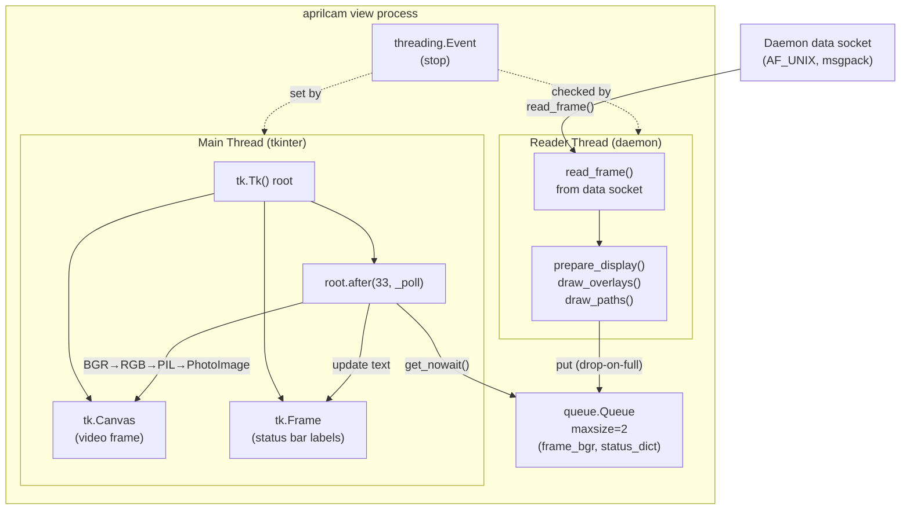
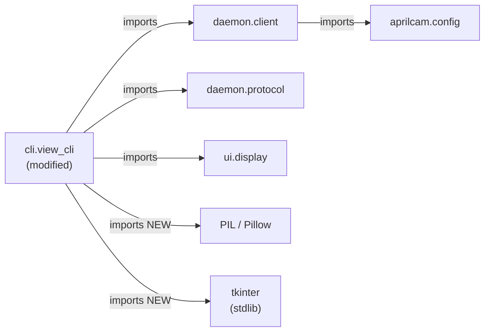
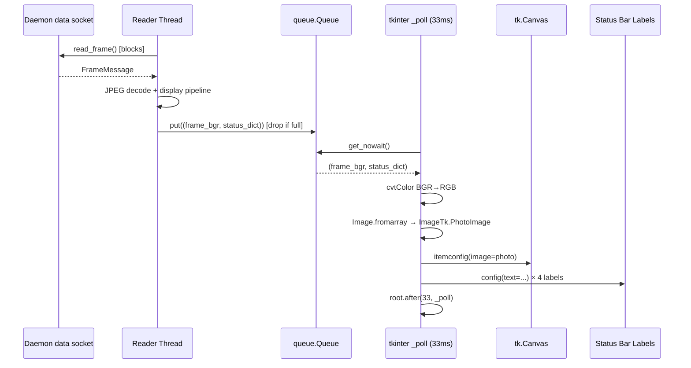

# Architecture Update — Sprint 003: aprilcam view — Positional Arg + tkinter GUI

## Step 1: Problem Understanding

Sprint 002 established the daemon-centric architecture. `aprilcam view`
(`view_cli.py`) is a stateless subscriber: it connects to the daemon's data
socket, decodes frames, runs the display pipeline client-side, and renders with
`cv.imshow()` / `cv.waitKey()` in a single-threaded loop.

Two problems remain with this viewer:

1. **Awkward CLI ergonomics**: `--camera` is a named required flag, but it is
   the only argument and it is always required. Positional arguments are the
   natural Python idiom for mandatory single arguments.

2. **OpenCV rendering limitations**: `cv.imshow()` creates a minimal OS window
   with no native chrome. Status information (FPS, tag count, calibration,
   deskew) is currently rendered as pixel-level text overlaid on the video
   frame via `draw_status_panel()`. This couples status display to the video
   pipeline, makes the text hard to read against busy backgrounds, and leaves
   no clean extension point for future controls.

This sprint fixes both problems with minimal structural impact: one argument
change in the argument parser, one threading refactor of the render loop, and
one new dependency (Pillow).

## Step 2: Responsibilities

**Changed responsibilities** (all within `aprilcam.cli.view_cli`):

1. **Argument parsing** — `--camera` (named, required) → `camera` (positional).
   One-line change in `argparse` configuration.

2. **Rendering orchestration** — The single-threaded `cv.imshow` loop is
   replaced by a two-thread model. The reader loop moves to a daemon thread;
   the tkinter event loop owns the main thread. A `queue.Queue(maxsize=2)`
   decouples them.

3. **Frame presentation** — BGR numpy arrays are converted to
   `ImageTk.PhotoImage` (via Pillow) and placed on a `tk.Canvas`. This replaces
   the `cv.imshow()` call.

4. **Status display** — FPS, tag count, calibration state, and deskew mode are
   displayed as `tk.Label` widgets in a status bar frame below the canvas.
   `draw_status_panel()` is removed.

5. **Window lifecycle** — Window close (×), `q`, and `Escape` all set a
   `threading.Event` to stop the reader thread and call `root.destroy()`.

**Responsibilities that do not change:**

- Daemon connection logic (control socket → `open_camera` or
  `get_camera_info` → data socket).
- Frame decoding (`read_frame`, JPEG decode, numpy conversion).
- `PlayfieldDisplay` usage (`prepare_display`, `draw_overlays`, `draw_paths`).
- Paths file mtime-watching and reload.
- `_tag_dict_to_aprilcam()` and `_load_paths()` helpers.

**No changes outside `view_cli.py` and `pyproject.toml`.**

## Step 3: Modules

### Module: `aprilcam.cli.view_cli` (modified)

**Purpose:** `aprilcam view <camera>` — stateless subscriber that connects to
the daemon and renders the live feed in a tkinter window with a status bar.

**Boundary (inside):**
- `main(argv)` entry point with positional `camera` argument.
- `_reader_thread(sock, display, queue, stop_event)` function: daemon socket
  read loop, display pipeline, queue put.
- `_poll(root, canvas, status_labels, queue, img_item, stop_event)` callback:
  tkinter after-loop, frame conversion, canvas update, label update.
- `_build_window(cam_name, frame_w, frame_h)` helper: creates `tk.Tk()`,
  `tk.Canvas`, status bar `tk.Frame` with four `tk.Label` widgets; binds
  `<q>`, `<Escape>`, `WM_DELETE_WINDOW`.
- `_convert_frame(frame_bgr)` helper: `cv.cvtColor` → `Image.fromarray` →
  `ImageTk.PhotoImage`.
- `_tag_dict_to_aprilcam()` and `_load_paths()` — unchanged helpers.

**Boundary (outside):** Does not open any camera directly. Does not import
`liveview` (deleted in sprint 002). Imports `tkinter`, `PIL.Image`,
`PIL.ImageTk` (new). Continues to import `aprilcam.daemon.client`,
`aprilcam.daemon.protocol`, `aprilcam.ui.display`.

**Use cases served:** SUC-001, SUC-002, SUC-003, SUC-004.

---

### Module: `pyproject.toml` (dependency addition)

**Purpose:** Declares `pillow>=10.0` as a runtime dependency.

**Boundary (inside):** Single line addition to `[project] dependencies`.

**Boundary (outside):** Pillow is used only in `view_cli.py`'s `_poll`
callback for `ImageTk.PhotoImage` conversion. No other module imports Pillow.

**Use cases served:** SUC-001, SUC-002 (prerequisite for the tkinter canvas).

---

## Step 4: Diagrams

### Component Diagram — view_cli.py Two-Thread Model

### Module Dependency Graph — Sprint 003 Changes

No cycles introduced. The new imports (Pillow, tkinter) are both leaf
dependencies — they import nothing from AprilCam internals.

### Data Flow — Frame Rendering (Sprint 003)

## Step 5: Document

### What Changed

| Component | Change |
|-----------|--------|
| `src/aprilcam/cli/view_cli.py` | Replace `--camera` named arg with positional `camera`; replace `cv.imshow`/`cv.waitKey` single-threaded loop with tkinter two-thread model; remove `draw_status_panel()` call; add status bar labels. |
| `pyproject.toml` | Add `pillow>=10.0` to `[project] dependencies`. |

**Unchanged:**
- `src/aprilcam/ui/display.py` — all drawing code stays as-is.
- `src/aprilcam/daemon/` — untouched.
- `src/aprilcam/server/mcp_server.py` — untouched.
- All other CLI modules.

### Why

The `--camera` named flag is awkward for the only required argument — positional
is the standard Python CLI idiom. The `cv.imshow` approach cannot support a
native status bar or future controls without more complex OpenCV GUI work.
tkinter is stdlib, has no additional licensing or install complexity beyond
Pillow, and gives a proper OS window with title bar, close button, and keyboard
bindings at zero architectural cost.

The two-thread model is forced by tkinter's requirement to own the main thread.
The reader loop cannot live on the main thread without blocking the event loop.
A `queue.Queue(maxsize=2)` with drop-on-full is the same backpressure strategy
already used by `CameraPipeline` for subscriber queues — it prevents lag
buildup when the display is slower than the source.

### Impact on Existing Components

- `ui.display.draw_status_panel()` is no longer called from `view_cli.py`.
  The method remains in the module (not deleted) — it may be used elsewhere
  or wanted in future. Removing the call is the only change.
- All other `PlayfieldDisplay` methods (`prepare_display`, `draw_overlays`,
  `draw_paths`) continue to be called identically.
- No changes to the daemon, MCP server, or config modules.
- The `aprilcam view` CLI command surface changes: `--camera NAME` becomes
  `CAMERA` (positional). Scripts calling `aprilcam view --camera ...` will
  break; callers must drop the `--camera` flag.

### Migration Concerns

- **Caller breakage**: Any script or shell alias using `aprilcam view --camera`
  must be updated to `aprilcam view` (positional). No internal callers exist
  in the codebase — `mcp_server.py` calls `aprilcam view` via
  `subprocess.Popen` with the camera name as a separate argument already.
  Verify the `start_live_view` MCP handler's Popen call passes the name
  positionally.
- **Pillow install**: `uv sync` after adding the dependency will fetch and
  install Pillow automatically. No manual steps.
- **tkinter availability**: tkinter is part of the Python standard library but
  may not be installed on headless servers (`python3-tk` package on Debian/Ubuntu).
  This is acceptable — `aprilcam view` is inherently a GUI command requiring
  a display.

## Step 6: Design Rationale

### Decision: tkinter over PyQt/wx/other GUI frameworks

**Context:** A GUI framework is needed to replace the bare `cv.imshow` window.

**Alternatives considered:**
- PyQt5/PySide6 — full-featured, but adds a large dependency (~50 MB) and
  LGPL/GPL licensing considerations; overkill for a status bar and a canvas.
- wxPython — similar overhead to PyQt; less commonly installed.
- Dear PyGui — game-oriented, fast, but unfamiliar and not stdlib.

**Why this choice:** tkinter is Python stdlib — zero new package dependencies
beyond Pillow (which is already needed for `ImageTk.PhotoImage`). It is
sufficient for a canvas + status bar. It is well-documented and the team
already understands it. No licensing concerns.

**Consequences:** tkinter is not hardware-accelerated and may have minor
rendering latency on very large frames. For the typical 640×480 or 1280×720
camera outputs in this project, this is imperceptible.

---

### Decision: Reader thread + tkinter main thread (not asyncio)

**Context:** tkinter requires the main thread; the daemon socket read is
blocking. The two concerns must be separated.

**Alternatives considered:**
- asyncio with `loop.run_in_executor` for the blocking read — would work but
  adds asyncio to what is currently a simple synchronous module; testing is
  harder; tkinter's `after()` loop is already event-driven and doesn't benefit
  from asyncio.
- Single thread with `sock.settimeout()` + `cv.waitKey`-style polling — avoids
  threads but requires careful timeout tuning and still does not satisfy
  tkinter's main-thread requirement.

**Why this choice:** A single background daemon thread for reading is the
simplest threading model. No shared mutable state between threads — the queue
is the only hand-off point, and `queue.Queue` is thread-safe by design.

**Consequences:** A crash in the reader thread will not propagate to the main
thread automatically. The reader thread should be started as `daemon=True` so
that Python exits cleanly even if it is blocked on `read_frame()` when the
window is closed.

---

### Decision: `queue.Queue(maxsize=2)` with drop-on-full (not blocking put)

**Context:** The reader may produce frames faster than the 33ms poll interval
can consume them, or vice versa. Blocking the reader on a full queue would
stall socket reads and eventually cause the daemon to detect a stalled
subscriber.

**Alternatives considered:**
- `queue.Queue()` (unbounded) — frames accumulate; viewer shows increasingly
  stale video.
- `queue.Queue(maxsize=1)` — maximally fresh, but one extra slot gives a small
  buffer for poll jitter.

**Why this choice:** Maxsize 2 matches the `CameraPipeline` per-subscriber
queue already in use. It provides one frame of slack without accumulating lag.
Drop-on-full (non-blocking `put_nowait`, discard on `Full`) is the same policy
the daemon uses for slow subscribers.

**Consequences:** The viewer may skip frames under load. This is correct and
expected behavior for a live view tool.

## Step 7: Open Questions

1. **`start_live_view` Popen call in `mcp_server.py`**: The MCP handler
   spawns `aprilcam view` via `subprocess.Popen`. After this sprint, the
   camera argument must be passed positionally, not as `--camera NAME`. This
   call must be verified and updated as part of T002 if it currently uses the
   named flag. No design decision required — straightforward code check.

2. **`draw_status_panel` retention**: The method is left in `display.py` but
   no longer called from `view_cli.py`. If nothing else calls it, it becomes
   dead code. A future cleanup sprint could remove it. No action required for
   this sprint.
