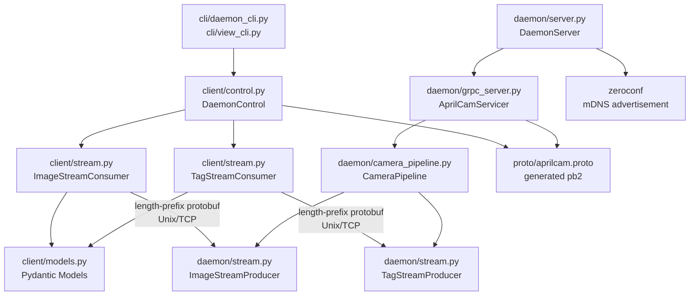

<!-- CLASI: Before changing code or making plans, review the SE process in CLAUDE.md -->

# Architecture Update — Sprint 004: Daemon Protocol Redesign & Homography Fix

## What Changed

### 1. gRPC control endpoint replaces JSON control socket

The `aprilcam.daemon.server` module no longer runs a newline-delimited JSON
accept loop. Instead, `aprilcam.daemon.grpc_server` implements the gRPC
servicer for the `AprilCam` service defined in `proto/aprilcam.proto`. The
`DaemonServer` starts the gRPC server (on Unix socket, TCP, or both) instead
of a raw socket accept loop.

### 2. Dual transport at startup

The daemon binds both a Unix domain socket and a TCP socket by default.
Startup flags control which transports are active.

| Flag | Default | Meaning |
|------|---------|---------|
| `--unix / --no-unix` | `--unix` | Enable/disable Unix socket transport |
| `--tcp / --no-tcp` | `--tcp` | Enable/disable TCP transport |
| `--tcp-port N` | 5280 | TCP port |
| `--unix-path PATH` | `/tmp/aprilcam/control.sock` | Unix socket path |

Both transports share the same gRPC servicer; the gRPC framework multiplexes
connections from either transport.

### 3. Split data stream: image stream and tag stream

The single per-camera `data.sock` (msgpack, frame + tags bundled) is replaced
by two independent streams per camera:

- **Image stream** — length-prefixed protobuf `ImageFrame` messages (JPEG bytes +
  frame_id + timestamps + dimensions).
- **Tag stream** — length-prefixed protobuf `TagFrame` messages (tag records +
  homography + playfield corners + fps).

Stream endpoints are not at well-known paths. The gRPC `GetImageStream` and
`GetTagStream` calls allocate the socket and return a `StreamEndpoint` response.

### 4. Producer/consumer classes own all socket I/O

- `ImageStreamProducer` (daemon side) — creates and owns the image stream
  server socket; called by `CameraPipeline` on each captured frame.
- `TagStreamProducer` (daemon side) — creates and owns the tag stream server
  socket; implements adaptive publish rate (8 px change threshold, 20 Hz cap,
  1 s heartbeat).
- `ImageStreamConsumer` (client side) — connects to the image stream endpoint;
  reads and decodes `ImageFrame` messages; exposes `read()`, `read_raw()`, and
  `__iter__`.
- `TagStreamConsumer` (client side) — connects to the tag stream endpoint;
  reads `TagFrame` protobuf and converts to Pydantic `TagFrame` model; exposes
  `read()` and `__iter__`.

### 5. Pydantic domain models replace untyped dicts

`aprilcam.client.models` provides `TagRecord`, `TagFrame`, `CameraInfo`, and
`PathRecord` as Pydantic models. Application code (view_cli, MCP tools, tests)
works only with these models. The proto-generated `*_pb2` types are used only
inside the consumer/producer/control adapter layer.

### 6. `DaemonControl` replaces `ControlClient`

`aprilcam.client.control.DaemonControl` wraps the gRPC stub and provides typed
methods: `list_cameras()`, `open_camera()`, `close_camera()`, `get_camera_info()`,
`capture_frame()`, `get_tags()`, `get_image_stream()`, `get_tag_stream()`,
`shutdown()`. `get_image_stream()` and `get_tag_stream()` call the respective gRPC
methods, construct and connect the consumer, and return it ready to iterate.

### 7. mDNS advertisement

When TCP is active, the daemon registers a `_aprilcam._tcp.local.` service record
via the `zeroconf` library at startup. The record is unregistered on exit. When
Unix-only mode is active, no mDNS registration occurs.

### 8. gRPC Server Reflection

The daemon enables the standard gRPC reflection service. This allows `grpcurl`,
`grpcui`, and client code to introspect the service schema at runtime.

### 9. Playfield homography bug fix

`Playfield._auto_discover_homography()` is moved from `__init__` time to
`start()` time. By that point the camera is open and `device_name` and
`(width, height)` are available. The call becomes:

```
discover_homography(device_name, width, height, data_dir=self._config.data_dir)
```

---

## Why

| Change | Reason |
|--------|--------|
| gRPC over JSON socket | Type safety, schema enforcement, reflection, TCP support |
| Dual transport by default | Local clients use Unix socket; remote clients use TCP |
| Split image + tag streams | Tag-only consumers avoid receiving and discarding JPEG data |
| Producer/consumer encapsulation | All socket I/O in one place; no raw socket calls in CLI code |
| Pydantic models | Validated, typed data throughout application code |
| mDNS | Automatic discovery on LAN without manual configuration |
| Homography fix | Bug causes world coordinates to always be None |

---

## Impact on Existing Components

| Component | Change |
|-----------|--------|
| `daemon/server.py` | Remove JSON accept loop; add gRPC server startup |
| `daemon/client.py` | Removed entirely; replaced by `client/control.py` |
| `daemon/camera_pipeline.py` | Call producers instead of building FrameMessage and fanning out to subscriber queues |
| `daemon/protocol.py` | Framing helpers reused by stream producers/consumers; `FrameMessage` dataclass removed |
| `cli/daemon_cli.py` | Replace all `ControlClient.rpc()` calls with `DaemonControl` typed methods |
| `cli/view_cli.py` | Remove raw socket code; use `DaemonControl.get_image_stream()` and `get_tag_stream()` |
| `core/playfield.py` | Defer `_auto_discover_homography()` to `start()` |
| `pyproject.toml` | Add `grpcio`, `grpcio-tools`, `grpcio-reflection`, `protobuf`, `zeroconf`, `pydantic` |

---

## Migration Concerns

- **Proto compilation**: `proto/aprilcam.proto` must be compiled to generate
  `aprilcam_pb2.py` and `aprilcam_pb2_grpc.py` before the daemon or client can
  import them. A build step (Makefile target or `scripts/compile_proto.py`) is
  needed. The generated files can be committed or regenerated at install time.
- **Old daemon must be stopped before upgrading**: Existing `control.sock` is a
  raw socket, not a gRPC endpoint. Any running old daemon must be stopped
  (`aprilcam daemon stop`) before installing the new version.
- **`view_cli.py` internal API break**: The socket-based streaming helpers are
  removed. `view_cli.py` is rewritten to use `ImageStreamConsumer` and
  `TagStreamConsumer`.

---

## Component Diagram



---

## Module Responsibilities

### `proto/aprilcam.proto`
Defines the gRPC `AprilCam` service and all protobuf message types. This is the
contract between daemon and client. Application code does not import from
`*_pb2` directly.

**Boundary**: Wire format only. No Python logic.

**Use cases served**: SUC-001, SUC-002, SUC-003, SUC-004, SUC-006

---

### `aprilcam.daemon.grpc_server` (new)
Implements `AprilCamServicer` — the gRPC service handler. Receives gRPC calls,
delegates to `DaemonServer`'s camera management methods, and manages
`ImageStreamProducer` / `TagStreamProducer` lifecycle.

**Boundary**: Inside — gRPC servicer logic, producer lifecycle. Outside — camera
hardware, frame processing, socket read/write.

**Use cases served**: SUC-001, SUC-002, SUC-003, SUC-004

---

### `aprilcam.daemon.stream` (new)
`ImageStreamProducer` and `TagStreamProducer`. Each producer owns its server
socket(s) (Unix, TCP, or both). `TagStreamProducer` implements the adaptive
publish logic (change threshold, rate cap, heartbeat timer).

**Boundary**: Inside — socket creation, length-prefix framing, publish rate logic,
protobuf serialization. Outside — camera capture, tag detection, gRPC.

**Use cases served**: SUC-003, SUC-004

---

### `aprilcam.client.control` (new)
`DaemonControl` — typed gRPC stub wrapper. Returns Pydantic models, not dicts.
`get_image_stream()` and `get_tag_stream()` return ready-to-iterate consumer objects.

**Boundary**: Inside — gRPC channel management, proto to Pydantic conversion for
one-shot calls, consumer construction. Outside — stream socket I/O (lives in consumers).

**Use cases served**: SUC-001, SUC-002, SUC-003, SUC-004, SUC-005

---

### `aprilcam.client.stream` (new)
`ImageStreamConsumer` and `TagStreamConsumer`. Each consumer owns its client socket.
Reads length-prefixed protobuf from the stream socket and converts to Pydantic models.

**Boundary**: Inside — socket connect, length-prefix framing, protobuf deserialization,
Pydantic conversion. Outside — gRPC, camera logic, display.

**Use cases served**: SUC-003, SUC-004, SUC-005

---

### `aprilcam.client.models` (new)
Pydantic domain models: `TagRecord`, `TagFrame`, `CameraInfo`, `PathRecord`.
These are what application code touches after deserialization.

**Boundary**: Inside — Pydantic field definitions. Outside — wire format, gRPC.

**Use cases served**: SUC-002, SUC-003, SUC-004, SUC-005

---

### `aprilcam.daemon.server` (updated)
`DaemonServer` — now starts a gRPC server (via `grpc_server`) instead of a JSON
accept loop. Manages camera pipelines and stream producers. Pidfile/flock logic
unchanged.

**Use cases served**: SUC-001, SUC-002

---

### `aprilcam.daemon.camera_pipeline` (updated)
`CameraPipeline` — calls `ImageStreamProducer.publish()` and
`TagStreamProducer.publish_if_changed()` instead of encoding `FrameMessage` and
pushing to subscriber queues.

**Use cases served**: SUC-003, SUC-004

---

## Design Rationale

### Decision: gRPC over raw JSON socket

**Context**: The current control socket is untyped, has no TCP option, and has
no schema validation.

**Alternatives**:
1. Keep JSON socket, add type wrappers — no TCP, no reflection, no schema.
2. HTTP/REST — heavier dependency, no streaming.
3. gRPC — typed stubs, streaming, reflection, dual transport.

**Why gRPC**: Schema via .proto; generated Python stubs; Server Reflection;
dual-transport (Unix + TCP) is first-class.

**Consequences**: Adds `grpcio` dependency; requires proto compilation step.

---

### Decision: Two separate streams instead of one bundled stream

**Context**: The current stream sends JPEG in every frame. Tag-only consumers
must receive and discard images.

**Alternatives**:
1. Bundled stream with optional JPEG — complicates framing and backpressure.
2. Split streams — two sockets per camera; each consumer subscribes independently.

**Why split**: Clean separation; tag-only consumers stay lightweight. `frame_id`
links the two streams when both are needed.

**Consequences**: Two stream sockets per open camera instead of one.

---

### Decision: Defer homography discovery to `start()` time

**Context**: `_auto_discover_homography()` in `__init__` cannot call
`discover_homography()` correctly — device_name and resolution are unavailable.

**Alternatives**:
1. Accept device_name and resolution as optional `Playfield.__init__` parameters.
2. Open camera briefly in `__init__` to read name/resolution.
3. Defer to `start()` — camera already open, simplest.

**Why defer**: No API change; no extra open/close; correct device_name guaranteed.

**Consequences**: Homography is not loaded until `start()` is called — correct
behaviour since Playfield is not usable before `start()` anyway.

---

## Open Questions

None. All design decisions are resolved per the issue specification.
