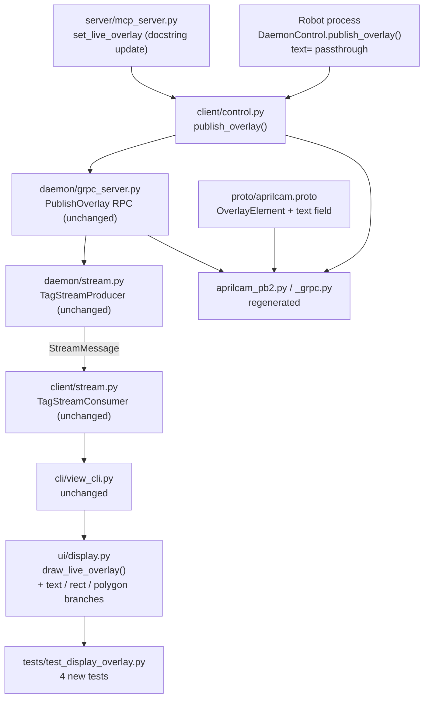

<!-- CLASI: Before changing code or making plans, review the SE process in CLAUDE.md -->

# Architecture Update — Sprint 006: Overlay Text, Rect, and Polygon Element Types

## What Changed

### 1. `proto/aprilcam.proto` — new `text` field on `OverlayElement`

A single field is added to the existing `OverlayElement` message:

```protobuf
message OverlayElement {
  string         type      = 1;
  repeated float params    = 2;
  repeated int32 color     = 3;
  int32          thickness = 4;
  string         text      = 5;  // content for "text" type elements
}
```

`rect` and `polygon` require no proto change — their coordinates are encoded in
the existing `params` float list.

The Python bindings (`aprilcam_pb2.py`, `aprilcam_pb2_grpc.py`) are regenerated.
The grpc file's import line is fixed to the package-relative form:
`from aprilcam.proto import aprilcam_pb2 as aprilcam__pb2`.

### 2. `aprilcam.ui.display` — three new draw branches in `draw_live_overlay()`

Three `elif` branches are added inside the per-element loop, after the existing
`"polyline"` case:

| Branch | Rendering call | Notes |
|--------|---------------|-------|
| `"text"` | `_draw_text_with_outline()` | Reuses existing static method; `params[2]` overrides `font_scale` (default 0.6) |
| `"rect"` | `cv.rectangle()` | `thickness=-1` maps to `cv.FILLED` |
| `"polygon"` | `cv.fillPoly()` or `cv.polylines(isClosed=True)` | Branch on sign of `thickness` |

All three branches follow the existing try/except guard pattern. No changes to
the `_w2d()` helper or `draw_live_overlay()` signature.

### 3. `aprilcam.client.control` — `text` field propagated in `publish_overlay()`

`OverlayElement(...)` construction in `publish_overlay()` gains:
```python
text=str(e.get("text", ""))
```
This is a backward-compatible addition — callers that omit `"text"` get an empty
string, which is the protobuf default.

### 4. `aprilcam.server.mcp_server` — `set_live_overlay` docstring updated

The tool docstring lists `"text"`, `"rect"`, and `"polygon"` in the element type
enumeration and documents the `text` key for `"text"` elements, `thickness=-1`
fill semantics for `"rect"` and `"polygon"`.

### 5. `src/aprilcam/ROBOT_API_GUIDE.md` — element types table extended

Three rows added; example snippet updated to include a `text` element.

---

## Why

| Change | Reason |
|--------|--------|
| `text` proto field | `"text"` element requires a string payload; float `params` cannot carry arbitrary text |
| New draw branches in `draw_live_overlay()` | Three common annotation types used by robot programs are not covered by Sprint 005 types |
| `text` passthrough in `control.py` | Without this, the `text` field is always empty even when the caller provides it |
| Docstring and guide update | Without documentation, callers cannot discover the new types |

---

## Impact on Existing Components

| Component | Change |
|-----------|--------|
| `proto/aprilcam.proto` | Add `string text = 5` to `OverlayElement` |
| `aprilcam_pb2.py` / `aprilcam_pb2_grpc.py` | Regenerated |
| `ui/display.py` | Three new `elif` branches inside `draw_live_overlay()` |
| `client/control.py` | One new keyword arg in `OverlayElement(...)` construction |
| `server/mcp_server.py` | Docstring update only — no logic change |
| `ROBOT_API_GUIDE.md` | Documentation update |
| `tests/test_display_overlay.py` | Four new tests |
| All other modules | No change |

---

## Migration Concerns

The `text` field addition to `OverlayElement` is a backward-compatible protobuf change
(new field, no renumbering). Existing callers that do not set `text` receive the default
empty string. No wire format change beyond the new field — `StreamMessage`, `OverlayFrame`,
and the `PublishOverlay` RPC are unchanged.

No data migration, no deployment sequencing concern.

---

## Component Diagram



---

## Module Responsibilities

### `proto/aprilcam.proto` (updated)
Adds `string text = 5` to `OverlayElement`. Remains the single wire-format contract.

**Boundary**: Wire format only. No Python logic.

**Use cases served**: SUC-001

---

### `aprilcam.ui.display` (updated)
`draw_live_overlay()` gains three new dispatch branches. Each branch maps world-cm
coordinates to display pixels via the existing `_w2d()` helper and calls the
appropriate OpenCV drawing function. No change to method signature or the existing
four element types.

**Boundary**: Inside — OpenCV drawing calls, world-to-pixel projection, TTL check.
Outside — socket I/O, proto decoding, UI event loop.

**Use cases served**: SUC-001, SUC-002, SUC-003

---

### `aprilcam.client.control` (updated)
`publish_overlay()` now passes `text=str(e.get("text", ""))` when constructing
`OverlayElement`. No other change to the method.

**Boundary**: gRPC channel management and proto-to-Python conversion. No socket logic.

**Use cases served**: SUC-001

---

### `aprilcam.server.mcp_server` (updated, docstring only)
`set_live_overlay` docstring lists the three new element types and their parameters.
No logic change.

**Boundary unchanged**: MCP protocol boundary; business logic lives in `DaemonControl`.

**Use cases served**: SUC-001, SUC-002, SUC-003

---

## Design Rationale

### Decision: Add `text` as a dedicated proto field, not encoded in `params`

**Context**: The `text` element needs a string payload. The existing `params` field
is `repeated float` — it cannot carry arbitrary text without lossy encoding.

**Alternatives**:
1. Encode text as ASCII codepoints in `params` — lossy, arbitrary length limit,
   no Unicode support, unreadable in proto dumps.
2. Add a separate proto message for text elements — over-engineering; a single
   optional field is sufficient.
3. Add `string text = 5` to the existing `OverlayElement` — minimal proto change,
   backward-compatible, clearly named.

**Why option 3**: Smallest change, backward-compatible, zero impact on `rect` and
`polygon` which need no new fields.

**Consequences**: Proto regeneration required. All consumers that construct
`OverlayElement` must be updated to pass the `text` keyword (defaulting to `""`).

---

### Decision: `rect` and `polygon` use existing `params` float list, no new fields

**Context**: Both element types are fully described by their coordinate lists.
`params` already carries `repeated float`.

**Why**: No proto change needed. Encoding is consistent with the existing `polyline`
and `arc` types. `thickness=-1` for fill is already established by the `point` type.

**Consequences**: None. The pattern is already in use.

---

## Open Questions

None. All design decisions are resolved per the issue specification.
