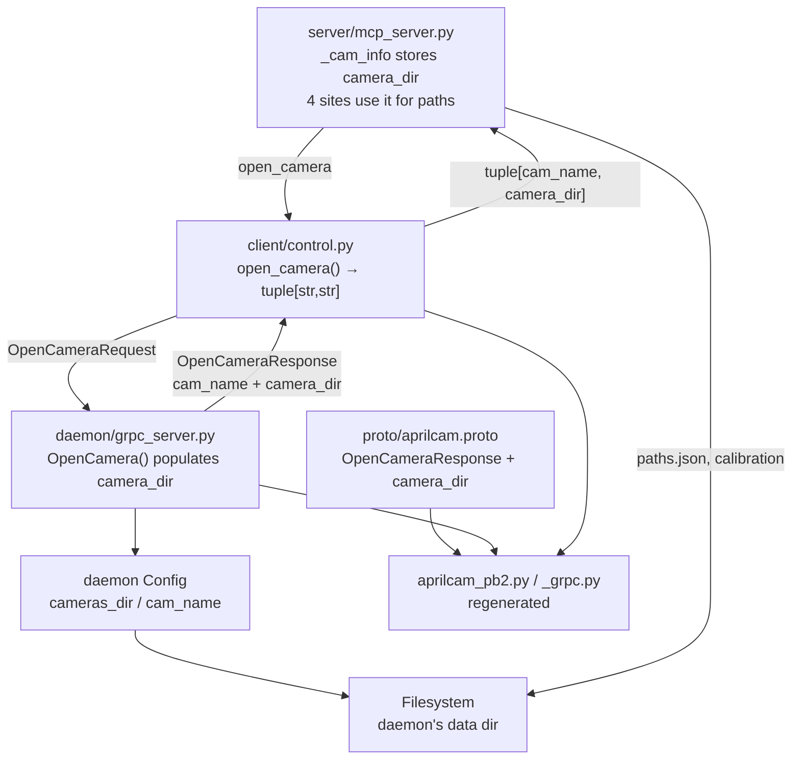

<!-- CLASI: Before changing code or making plans, review the SE process in CLAUDE.md -->

# Architecture Update — Sprint 007: Fix MCP Server File Path Resolution

## What Changed

### 1. `proto/aprilcam.proto` — add `camera_dir` to `OpenCameraResponse`

```protobuf
message OpenCameraResponse {
  string cam_name   = 1;
  string camera_dir = 2;   // absolute path to daemon's per-camera data directory
}
```

`camera_dir` is the absolute path `cameras_dir / cam_name` as computed by the daemon's `Config` instance. Adding a field at position 2 is a backward-compatible proto change.

### 2. `aprilcam.daemon.grpc_server` — populate `camera_dir` in `OpenCamera()`

Both return points in `OpenCamera()` are updated to populate the new field:

- The normal return (after opening the camera)
- The already-open early-return (when the camera is already registered)

```python
camera_dir = str(self._config.cameras_dir / cam_name)
return aprilcam_pb2.OpenCameraResponse(cam_name=cam_name, camera_dir=camera_dir)
```

The daemon's `_config` is already initialized at startup from the daemon's own CWD — this is the single authoritative source of the path.

### 3. `aprilcam.client.control` — `open_camera()` returns `(cam_name, camera_dir)`

Return type changes from `str` to `tuple[str, str]`:

```python
def open_camera(self, index: int) -> tuple[str, str]:
    resp = stub.OpenCamera(aprilcam_pb2.OpenCameraRequest(index=index))
    return str(resp.cam_name), str(resp.camera_dir)
```

### 4. `aprilcam.server.mcp_server` — four sites updated

| Site | Line | Old approach | New approach |
|------|------|-------------|--------------|
| `open_camera` | ~475 | `Config.load().data_dir` to compute `paths_file` | Use `camera_dir` from tuple; store in `_cam_info` |
| `_get_paths_file()` fallback | ~248 | `Config.load()` + read `info.json` from disk | `Path(_cam_info[camera_id]["camera_dir"]) / "paths.json"` |
| `create_playfield` | ~669 | `Config.load()` to derive local `cam_dir` | `Path(_cam_info[camera_id]["camera_dir"])` |
| `calibrate_playfield` | ~822 | `Config.load()` to derive `cfg.calibration_dir` | `Path(_cam_info[cam_name]["camera_dir"])` |

After these changes, no path computation in `mcp_server.py` depends on the MCP server's CWD.

### 5. Protobuf regeneration and import fix

The generated files `aprilcam_pb2.py` and `aprilcam_pb2_grpc.py` are regenerated. The grpc file's bare import is fixed:

```python
# Before:
import aprilcam_pb2 as aprilcam__pb2
# After:
from aprilcam.proto import aprilcam_pb2 as aprilcam__pb2
```

---

## Why

| Change | Reason |
|--------|--------|
| `camera_dir` proto field | Single source of truth: daemon knows where its files are |
| Both `OpenCamera()` return paths updated | Early-return (camera already open) must also carry the path |
| `open_camera()` returns tuple | Propagate the new field to callers without a separate RPC call |
| Four `mcp_server.py` edits | Eliminate all `Config.load()` calls that depend on MCP CWD |
| Proto regeneration | Required after any `.proto` change |
| Import fix | Package-relative import is required for pipx-installed packages |

---

## Impact on Existing Components

| Component | Change |
|-----------|--------|
| `proto/aprilcam.proto` | Add `string camera_dir = 2` to `OpenCameraResponse` |
| `aprilcam_pb2.py` / `aprilcam_pb2_grpc.py` | Regenerated |
| `daemon/grpc_server.py` | Populate `camera_dir` in `OpenCamera()` at both return points |
| `client/control.py` | `open_camera()` return type `str` → `tuple[str, str]` |
| `server/mcp_server.py` | Four edits to eliminate `Config.load()` path computation |
| All other modules | No change |

---

## Migration Concerns

The `camera_dir` proto field addition is backward-compatible (new field, no renumbering, no type change). Existing callers that ignore `camera_dir` continue to work without modification.

The `open_camera()` return type change in `client/control.py` is a breaking change within this codebase. The only caller is `mcp_server.py`, which is updated in the same ticket.

No data migration, no deployment sequencing concern.

---

## Component Diagram



---

## Module Responsibilities

### `proto/aprilcam.proto` (updated)
Adds `string camera_dir = 2` to `OpenCameraResponse`. Remains the single wire-format contract between daemon and clients.

**Boundary**: Wire format only. No Python logic.
**Use cases served**: SUC-001

---

### `aprilcam.daemon.grpc_server` (updated)
`OpenCamera()` computes `camera_dir` from `self._config.cameras_dir / cam_name` and includes it in the response. The daemon's `Config` is initialized once at startup from the daemon's CWD — it is the authority.

**Boundary**: gRPC service implementation. No path logic beyond what `Config` provides.
**Use cases served**: SUC-001

---

### `aprilcam.client.control` (updated)
`open_camera()` unpacks both fields from `OpenCameraResponse` and returns them as a tuple. No path computation — it is a pass-through.

**Boundary**: gRPC channel management and proto-to-Python conversion.
**Use cases served**: SUC-001

---

### `aprilcam.server.mcp_server` (updated)
At `open_camera` time, stores `camera_dir` in `_cam_info`. All four path-computation sites are replaced with lookups into `_cam_info["camera_dir"]`. No `Config.load()` calls remain for path computation.

**Boundary**: MCP protocol boundary. Path authority is delegated to the daemon via `_cam_info`.
**Use cases served**: SUC-001

---

## Design Rationale

### Decision: Add `camera_dir` to `OpenCameraResponse`, not a separate RPC

**Context**: The MCP server needs the daemon's authoritative data path. Options include a dedicated `GetCameraInfo` RPC, reading a config file, or piggybacking on the existing `OpenCamera` response.

**Alternatives**:
1. Dedicated `GetCameraInfo` RPC — extra round-trip, extra proto message, extra client method. Adds complexity for one field.
2. Shared config file that both daemon and MCP server read — still CWD-dependent; requires out-of-band agreement on config file location.
3. Add `camera_dir` to `OpenCameraResponse` — zero extra round-trips; path is available exactly when needed; minimal proto change.

**Why option 3**: The MCP server already calls `OpenCamera` before any path operation. Piggyback is the simplest, least invasive approach. The field is small and stable for the lifetime of the camera handle.

**Consequences**: `open_camera()` return type changes from `str` to `tuple[str, str]`. The only caller (`mcp_server.py`) is updated in the same ticket.

---

## Open Questions

None. The fix is fully specified in the issue document.
