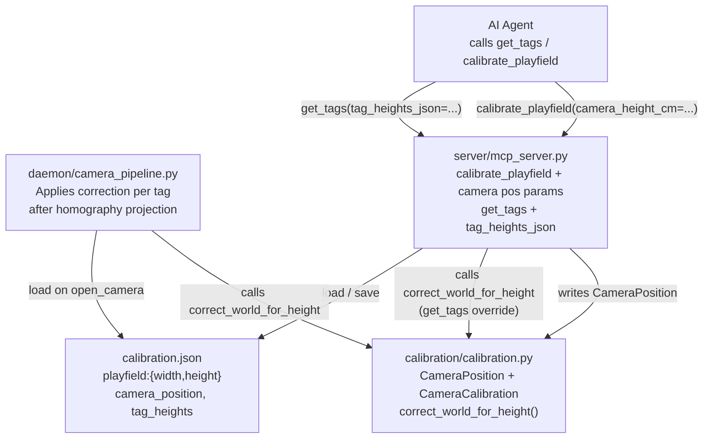
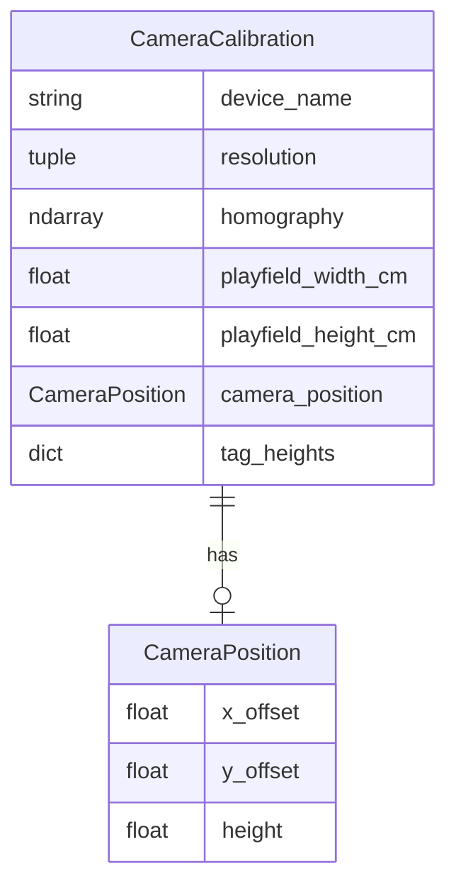

<!-- CLASI: Before changing code or making plans, review the SE process in CLAUDE.md -->

# Architecture Update — Sprint 008: Parallax correction and calibration restructuring

## What Changed

### 1. `calibration/calibration.py` — new `CameraPosition` dataclass

```python
@dataclass
class CameraPosition:
    x_offset: float = 0.0   # cm from field center, positive = right
    y_offset: float = 0.0   # cm from field center, positive = up
    height: float = 0.0     # cm above playfield
```

A value object describing the camera's 3D position relative to the
playfield center. No methods; used only as data.

### 2. `calibration/calibration.py` — `CameraCalibration` new fields and method

Four new fields are added to the existing dataclass:

| Field | Type | Default | Purpose |
|-------|------|---------|---------|
| `playfield_width_cm` | `float` | `0.0` | Playfield width from corner to corner |
| `playfield_height_cm` | `float` | `0.0` | Playfield height from corner to corner |
| `camera_position` | `Optional[CameraPosition]` | `None` | 3D camera location |
| `tag_heights` | `dict[int, float]` | `{}` | Per-tag-ID height above playfield in cm |

New method:

```python
def correct_world_for_height(
    self, wx: float, wy: float, tag_height_cm: float
) -> tuple[float, float]:
    if self.camera_position is None or self.camera_position.height == 0.0:
        return wx, wy
    H = self.camera_position.height
    cx = self.camera_position.x_offset
    cy = self.camera_position.y_offset
    r = tag_height_cm / H
    return (wx + r * (cx - wx), wy + r * (cy - wy))
```

This is the only location in the codebase that performs parallax math.

### 3. `calibration/calibration.py` — load/save format update

**`load_calibration_from_camera_dir()`** gains backward-compatible reading:
- Tries `data["playfield"]["width"]` / `data["playfield"]["height"]` first.
- Falls back to `data["field_width_cm"]` / `data["field_height_cm"]` for
  old files.
- Reads `data.get("camera_position")` → `CameraPosition` (or `None`).
- Reads `data.get("tag_heights", {})` with string keys converted to `int`.

**`save_calibration_to_camera_dir()`** writes new format only:
- Replaces the `field_width_cm` / `field_height_cm` top-level keys with
  `playfield: {width: ..., height: ...}`.
- Writes `camera_position: {x_offset, y_offset, height}` when present.
- Writes `tag_heights: {id: height_cm}` (string keys for JSON
  compatibility).
- The `_CALIBRATION_KEYS` sentinel set is updated so old keys are
  recognised as calibration-owned and not preserved in the user-managed
  section.

**`load_field_dimensions_from_camera_dir()`** gains the same fallback:
tries `playfield.width`/`playfield.height` first, then old keys.

### 4. `daemon/camera_pipeline.py` — per-tag parallax correction

After the homography projection sets `world_xy` for each `AprilTag`, the
pipeline applies the correction:

```python
if self._calibration and self._calibration.camera_position:
    tag_h = self._calibration.tag_heights.get(tr.id, 0.0)
    if tag_h > 0.0 and tr.world_xy is not None:
        tr.world_xy = self._calibration.correct_world_for_height(
            tr.world_xy[0], tr.world_xy[1], tag_h
        )
```

The pipeline holds no geometry knowledge; it only delegates to the method.

### 5. `server/mcp_server.py` — `calibrate_playfield` new parameters

Three new optional parameters are added:

| Parameter | Type | Default | Meaning |
|-----------|------|---------|---------|
| `camera_height_cm` | `float` | required | Camera height above playfield |
| `camera_x_offset_cm` | `float` | `0.0` | Camera x offset from center |
| `camera_y_offset_cm` | `float` | `0.0` | Camera y offset from center |

After computing the homography, the handler constructs a `CameraPosition`
and stores it on the `CameraCalibration` before saving to `calibration.json`.
The field dimensions passed to `save_calibration_to_camera_dir` use the
same `field_spec.width_cm` / `field_spec.height_cm` values as before;
the function signature of `save_calibration_to_camera_dir` is unchanged
(it writes them under the new `playfield` key internally).

### 6. `server/mcp_server.py` — `get_tags` height override parameter

One new optional parameter:

| Parameter | Type | Default | Meaning |
|-----------|------|---------|---------|
| `tag_heights_json` | `str \| None` | `None` | JSON dict mapping tag_id→height_cm |

When present, the handler merges this dict over `calibration.tag_heights`
(persistent values are the base; per-call values override). Correction is
then applied to each tag's `world_xy` using the merged heights. The merge
is local to the request; the persisted `calibration.tag_heights` is never
modified.

---

## Why

| Change | Reason |
|--------|--------|
| `CameraPosition` dataclass | Encapsulates camera 3D geometry; clean separation from tag data |
| `playfield_width_cm`/`playfield_height_cm` on `CameraCalibration` | These values were previously only in JSON; making them first-class fields enables future use without re-reading the file |
| `correct_world_for_height` on `CameraCalibration` | Keeps all geometry in one place; callers need no math |
| New JSON sub-dict layout | Reduces top-level clutter; groups related fields; retains old keys on read for backward compatibility |
| Daemon pipeline correction | Correction applied once at detection time, transparent to all downstream consumers |
| `calibrate_playfield` params | Allows setting camera position in one calibration call rather than a manual JSON edit |
| `get_tags` height override | Enables runtime experimentation (e.g. `h=0` to verify uncorrected baseline) without restarting the daemon |

---

## Impact on Existing Components

| Component | Impact |
|-----------|--------|
| `calibration/calibration.py` | Additive: new dataclass, new fields, new method, updated load/save |
| `daemon/camera_pipeline.py` | Additive: 5-line correction block after world_xy computation; no existing logic touched |
| `server/mcp_server.py` | Additive: new params on two existing tools; no existing param removed |
| `ui/display.py` | No change — does not read `field_width_cm`/`field_height_cm` as object attributes |
| Existing `calibration.json` files | Still load; old keys produce correct values via fallback |
| All other modules | No change |

**Key finding**: no code in the codebase reads `.field_width_cm` or
`.field_height_cm` as an attribute on a `CameraCalibration` object.
These were JSON keys written alongside the calibration but never
deserialized into the dataclass. The issue description's "rename"
instruction refers to adding these as new attributes with the new names,
not renaming existing ones. No attribute-access sites require updating.

---

## Migration Concerns

Old `calibration.json` files continue to load correctly. The save path
writes new format only — so after any `calibrate_playfield` call the
file is upgraded. Operators who inspect files manually will see the
`playfield` sub-dict instead of top-level keys.

No deployment sequencing concerns. No schema migration scripts needed.

---

## Component Diagram



---

## Entity Relationship Diagram



---

## Module Responsibilities

### `calibration/calibration.py` (updated)
Owns all calibration geometry: homography, camera intrinsics, playfield
dimensions, camera position, and the parallax correction formula.

**Boundary**: Pure data and math. No I/O beyond the load/save helper
functions already present. No dependency on daemon or server modules.
**Use cases served**: SUC-001, SUC-002

---

### `daemon/camera_pipeline.py` (updated)
Orchestrates the per-frame detection loop and applies the calibration's
correction to each tag after homography projection.

**Boundary**: Reads calibration on startup; calls `correct_world_for_height`
per tag when the condition is met. Does not implement correction math.
**Use cases served**: SUC-003

---

### `server/mcp_server.py` (updated)
Exposes calibration and tag-query operations to AI agents. Adds camera
position recording to `calibrate_playfield`; adds per-call height override
to `get_tags`.

**Boundary**: MCP tool boundary. Delegates correction math to
`CameraCalibration`. Does not re-implement the formula.
**Use cases served**: SUC-003

---

## Design Rationale

### Decision: correction method on `CameraCalibration`, not a free function

**Context**: The correction needs camera position and per-tag heights.
These could live in the pipeline or in a separate module.

**Alternatives**:
1. Free function in a `parallax.py` module — adds a module for five lines
   of math; no cohesion benefit.
2. Inline in `camera_pipeline.py` — mixes geometry into orchestration.
3. Method on `CameraCalibration` — cohesive: the object already owns all
   camera geometry; the math uses only its own fields.

**Why option 3**: `CameraCalibration` already holds homography and
intrinsics. Adding camera position and correction keeps all camera
geometry in one place. The pipeline and server delegate without
understanding the math.

**Consequences**: `CameraCalibration` grows slightly but remains cohesive.

---

### Decision: backward-compatible read, new-format-only write

**Context**: Existing `calibration.json` files use top-level
`field_width_cm` / `field_height_cm`. Changing the load path would break
existing setups.

**Why**: Reading both formats costs two dict lookups; the benefit (no
operator intervention on upgrade) outweighs the trivial cost. Writing
new-format-only prevents the accumulation of both key styles in the same
file after the first save.

**Consequences**: After the first `calibrate_playfield` call post-upgrade,
the file is in new format permanently.

---

## Open Questions

None. The specification is fully detailed in the issue file.
