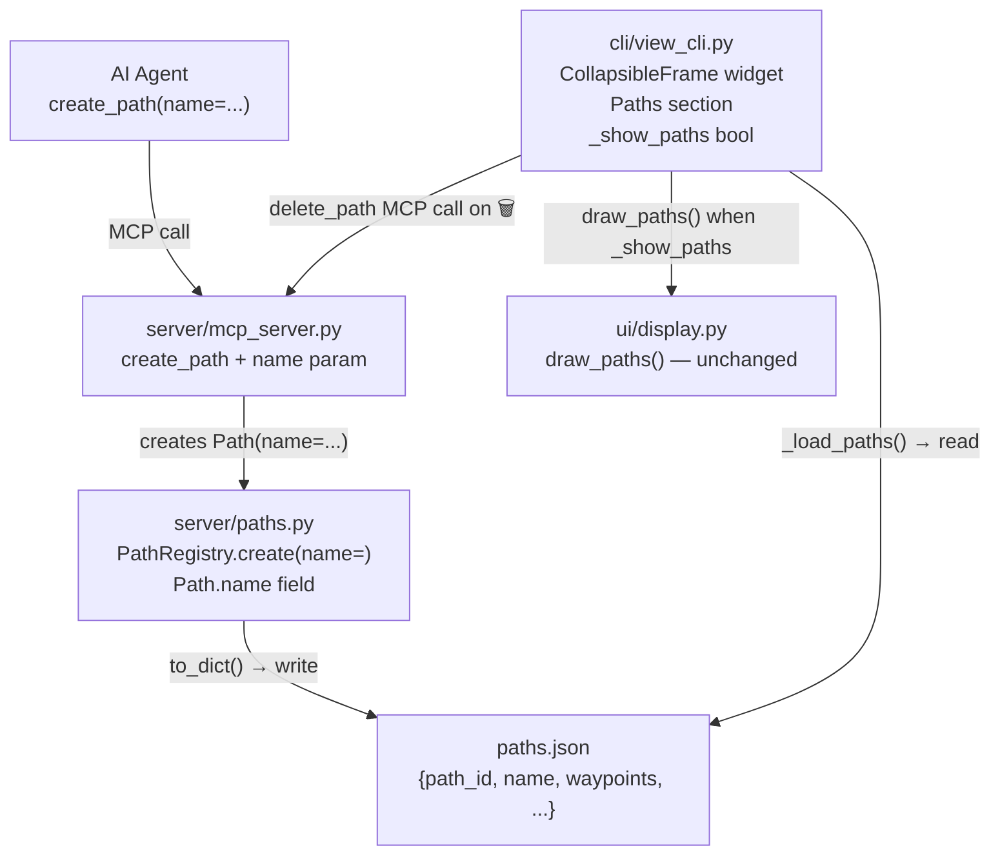
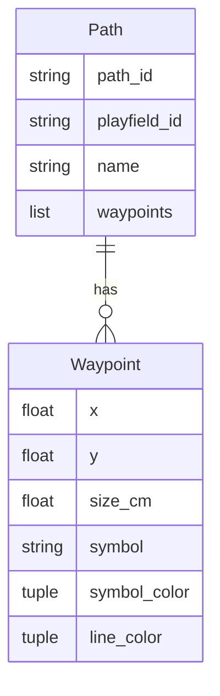

<!-- CLASI: Before changing code or making plans, review the SE process in CLAUDE.md -->

# Architecture Update — Sprint 009: Viewer collapsible panels and paths sidebar

## What Changed

### 1. `server/paths.py` — `name` field on `Path` dataclass

```python
@dataclass
class Path:
    path_id: str
    playfield_id: str
    waypoints: List[Waypoint]
    name: str = ""   # optional display name; falls back to path_id if blank
```

`to_dict()` adds `"name": self.name`. The `_load_paths()` helper in `view_cli.py`
already does dict deserialization; it reads `item.get("name", "")` for the new field
(no schema version bump needed — the field is optional with a safe default).

`PathRegistry.create()` gains a `name: str = ""` parameter and passes it to the
`Path` constructor.

### 2. `server/mcp_server.py` — `name` parameter on `create_path`

```python
async def create_path(
    playfield_id: str,
    waypoints_json: str,
    name: str = "",
) -> list[TextContent]:
```

The handler passes `name` to `PathRegistry.create()`. No other MCP tools change.

### 3. `cli/view_cli.py` — `CollapsibleFrame` widget

A new `CollapsibleFrame(tk.Frame)` helper class is defined at module level (before
`main()`). It owns:
- A header sub-frame containing a `ttk.Label` (or small `tk.Button`) with the
  triangle character (▼ expanded, ▶ collapsed) and a title label.
- A `content` attribute: a `tk.Frame` that callers populate.
- A `toggle()` method that alternates between `self.content.grid()` and
  `self.content.grid_remove()`, swapping the triangle character.
- An optional `on_expand` / `on_collapse` callback pair for side-effect wiring.

The widget uses `grid` internally for header and content; the outer `CollapsibleFrame`
itself is placed in the right panel with `pack`, matching the existing layout.

### 4. `cli/view_cli.py` — Replace `LabelFrame` sections with `CollapsibleFrame`

The four existing sections are replaced:

| Old widget | New widget | Content |
|---|---|---|
| `status_frame` (LabelFrame) | `CollapsibleFrame("Camera Status")` | FPS / Tags / Calibrated / Deskew kv rows |
| `mob_frame` (LabelFrame) | `CollapsibleFrame("Mobile Tags")` | `mobile_text` Text + scrollbar |
| `stat_outer` (LabelFrame) | `CollapsibleFrame("Stationary Tags")` | `stat_text` Text + scrollbar |
| `obj_outer` + `btn_objects` | `CollapsibleFrame("Objects")` | `obj_text` Text + scrollbar |

The `btn_objects` button and `_toggle_objects()` function are removed. The Objects
`CollapsibleFrame` is given `on_collapse=lambda: _detect_objects.clear()` and
`on_expand=_lazy_start_objects` (a new helper that lazily inits `ColorClassifier`
and calls `_detect_objects.set()`).

### 5. `cli/view_cli.py` — Paths section

A new `CollapsibleFrame("Paths")` is added below Objects. Its state controls a
`_show_paths` mutable container (list of one bool, same pattern as `_detect_objects`):
- `on_collapse`: sets `_show_paths[0] = False`
- `on_expand`: sets `_show_paths[0] = True`

The render loop in `_process_frame_and_tags` checks `_show_paths[0]` before calling
`display.draw_paths()`.

The paths list is refreshed each poll cycle (same cadence as the tag tables) by
reading `_load_paths(_paths_file)`. For each path dict the panel renders one row
inside a scrollable inner frame:

```
[▸ symbol canvas 16×16] [line swatch 20×4] [name/id label]  [🗑 button]
```

- **Symbol canvas**: a `tk.Canvas(width=16, height=16)` that draws the first
  waypoint's symbol using simple geometry calls (matching the 8-symbol set in
  `draw_paths()`). Drawn in `symbol_color` (RGB → hex conversion for Tk).
- **Line swatch**: a `tk.Canvas(width=20, height=4)` filled with the first
  waypoint's `line_color`.
- **Label**: `path["name"] or path["path_id"]`
- **Delete button**: calls `_delete_path(path_id)`, a new helper that invokes the
  `delete_path` MCP tool (via `asyncio.run` or the existing async execution pattern
  in the file) then calls `_refresh_paths()` to re-render the list.

Row widgets are held in a dict keyed by `path_id`; the refresh function destroys all
existing row widgets and rebuilds from the current `_load_paths()` result.

---

## Why

| Change | Reason |
|---|---|
| `CollapsibleFrame` widget | Users need to collapse sections to reduce visual noise; four sections need consistent toggle behavior |
| Replace `LabelFrame` with `CollapsibleFrame` | One reusable class replaces four ad-hoc layout patterns; reduces duplication |
| Objects wiring via callbacks | Removes the redundant toggle button; collapse/expand IS the toggle |
| `Path.name` field | Agents need to label paths for human-readable display in the panel |
| `create_path` `name` param | Exposes the new model field to MCP callers without any protocol change |
| Paths section | Agents draw paths but users had no visibility or management; this closes the gap |
| `_show_paths` bool | Collapsing the section implies "I don't want to see paths" — the render loop must respect this |

---

## Impact on Existing Components

| Component | Impact |
|---|---|
| `server/paths.py` | Additive: new `name` field with default `""`. `to_dict()` extended. `PathRegistry.create()` gains `name` param. No breaking change. |
| `server/mcp_server.py` | Additive: new optional `name` param on `create_path`. No existing params changed. |
| `cli/view_cli.py` | Structural refactor of right-panel layout; `btn_objects` and `_toggle_objects` removed; `CollapsibleFrame` class added; Paths section added. No changes to detection logic or streaming. |
| `ui/display.py` | No change — `draw_paths()` signature is unchanged; caller adds a guard. |
| `paths.json` | Backward compatible — new `name` key written; old files without `name` read as `""`. |
| All other modules | No change. |

---

## Migration Concerns

Existing `paths.json` files without a `name` key load correctly because `_load_paths()`
uses `item.get("name", "")`. No migration scripts needed. After the first `create_path`
call or path save cycle the file will include `name`.

No deployment sequencing concerns. No database changes.

---

## Component Diagram



---

## Entity Relationship Diagram



---

## Module Responsibilities

### `server/paths.py` (updated)
Owns the `Path` and `Waypoint` data model and the `PathRegistry`. Now includes the
optional display `name` on `Path`.

**Boundary**: Pure data and in-memory storage. No I/O, no Tk, no MCP protocol.
No dependency on server or CLI modules.
**Use cases served**: SUC-003

---

### `server/mcp_server.py` (updated)
Exposes path management to AI agents. `create_path` now accepts `name` and passes
it to the registry.

**Boundary**: MCP tool surface. Delegates all logic to `PathRegistry`. Does not
implement path rendering or file I/O beyond `paths.json` write.
**Use cases served**: SUC-003, SUC-005

---

### `cli/view_cli.py` (updated)
Owns the live viewer window. New responsibilities: `CollapsibleFrame` widget class;
Paths section rendering; `_show_paths` flag; per-path delete via MCP call.

**Boundary**: Tk UI and polling loop. Reads `paths.json` directly (not via MCP) to
avoid async overhead in the poll callback. Calls `delete_path` MCP tool via existing
async execution mechanism for mutations.
**Use cases served**: SUC-001, SUC-002, SUC-003, SUC-004, SUC-005

---

## Design Rationale

### Decision: `CollapsibleFrame` as a standalone class, not inline per section

**Context**: Four sections need identical toggle behavior. Options: inline per-section
toggle logic (repeated four times) or a shared class.

**Why class**: DRY, testable in isolation, consistent behavior. The class is small
(~30 lines) and has no external dependencies — appropriate for a helper class defined
at module level.

**Consequences**: All four sections use identical expand/collapse mechanics. Adding a
fifth section costs one line.

---

### Decision: `_show_paths` as a mutable list `[True]` rather than `threading.Event`

**Context**: The render loop runs in the image reader thread; the toggle callback
runs in the Tk main thread. A `threading.Event` would work but carries the semantics
of "something happened" rather than "current state is X".

**Alternatives**: `threading.Event` (already used for `_detect_objects`), a plain
`bool` (not thread-safe), or a `threading.Lock`-protected bool.

**Why mutable list**: Consistent with the existing pattern for `_latest_tag_frame`,
`_latest_overlay`, etc. A single-element list provides thread-safe reads for a boolean
without introducing new synchronization primitives. The write happens in the Tk thread
(GIL-safe); the read is a simple index dereference.

**Consequences**: Slight unconventionality vs. `threading.Event`; consistent with
existing patterns in the file.

---

### Decision: `_load_paths()` for display reads, MCP call only for delete

**Context**: The Paths section needs to show the current list each poll frame. Options:
query via MCP `list_paths` tool (async, network round-trip) or read `paths.json`
directly (synchronous, local file).

**Why direct file read**: `view_cli.py` already uses `_load_paths()` for the
`draw_paths()` call. Reusing the same read for the panel row render keeps the data
source single and avoids the complexity of async calls inside the Tk poll callback.
Delete is a mutation so it correctly uses the MCP tool.

**Consequences**: Display reads and deletions use different paths (file vs. MCP),
which is acceptable because display is read-only.

---

## Open Questions

None. The issue specification is complete and all design decisions are resolved above.
