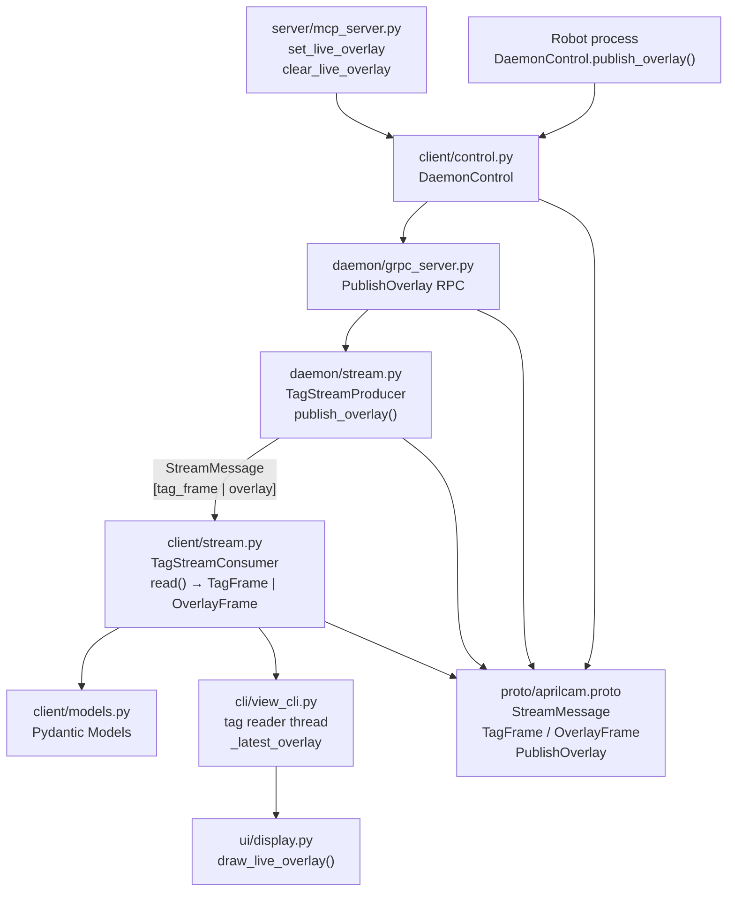

<!-- CLASI: Before changing code or making plans, review the SE process in CLAUDE.md -->

# Architecture Update — Sprint 005: Live Overlay via Tag Stream

## What Changed

### 1. Wire format: `StreamMessage` oneof wrapper on the tag stream

The tag stream socket previously carried bare `TagFrame` protobuf messages
(length-prefix framing). It now carries `StreamMessage` — a protobuf oneof
wrapper — so a single socket can deliver both `TagFrame` and `OverlayFrame`
messages to all subscribers.

```
Old framing: [4-byte len][TagFrame bytes]
New framing: [4-byte len][StreamMessage bytes]
             where StreamMessage.oneof payload { TagFrame | OverlayFrame }
```

All senders (`TagStreamProducer`) and receivers (`TagStreamConsumer`, `view_cli`)
are updated atomically. The image stream is unchanged.

### 2. New protobuf messages: `OverlayElement`, `OverlayFrame`, `StreamMessage`

Added to `proto/aprilcam.proto`:

| Message | Purpose |
|---------|---------|
| `OverlayElement` | One graphical primitive: type string + float params + RGB color + thickness |
| `OverlayFrame` | Collection of elements with timestamp, TTL, and camera_id |
| `StreamMessage` | Oneof wrapper: `tag_frame` or `overlay` |

Element types and their `params` encoding:

| type | params |
|------|--------|
| `arc` | `[cx, cy, radius, start_deg, end_deg]` (world cm) |
| `arrow` | `[x1, y1, x2, y2]` (world cm) |
| `point` | `[x, y, radius_cm]` (world cm) |
| `polyline` | `[x0, y0, x1, y1, ...]` (world cm) |

### 3. New gRPC RPC: `PublishOverlay`

Added to the `AprilCam` service:

```protobuf
rpc PublishOverlay (PublishOverlayRequest) returns (StatusReply);

message PublishOverlayRequest {
  string cam_name      = 1;
  OverlayFrame overlay = 2;
}
```

`AprilCamServicer.PublishOverlay()` looks up the `TagStreamProducer` for
`cam_name` and calls `producer.publish_overlay(request.overlay)`.

### 4. `TagStreamProducer.publish_overlay()` — bypass rate limiting

`TagStreamProducer` gains a `publish_overlay(overlay_frame: OverlayFrame)` method.
Unlike `publish_if_changed()`, this method bypasses change detection and rate
limiting and broadcasts the wrapped `StreamMessage` immediately to all subscribers.
Overlays are time-critical and externally rate-controlled by the caller.

### 5. `TagStreamConsumer.read()` return type widens to `TagFrame | OverlayFrame`

`TagStreamConsumer.read()` now decodes a `StreamMessage` and dispatches on the
oneof field:
- `tag_frame` present: convert to Pydantic `TagFrame` model (unchanged path).
- `overlay` present: return the `OverlayFrame` proto message directly.

The proto-to-Pydantic conversion layer for tag frames is unchanged. `OverlayFrame`
is returned as a raw proto object because it is display-only and not part of the
domain model.

### 6. `DaemonControl.publish_overlay()` — new client method

`DaemonControl` gains:

```python
def publish_overlay(
    self,
    cam_name: str,
    elements: list[dict],
    ttl: float = 1.0,
) -> bool
```

Builds `OverlayFrame` from the element list and calls `stub.PublishOverlay()`.
Returns `True` on success.

### 7. `display.draw_live_overlay()` — new render method

`aprilcam.ui.display` gains `draw_live_overlay(frame, overlay_frame, homography)`:

- No-op when `homography is None`.
- Drops expired overlays: `time.time() - overlay.timestamp > overlay.ttl`.
- Extracts private `_world_to_disp_with_hinv(x, y, H_inv)` helper shared with
  existing path-drawing logic.
- Dispatches on `element.type`; unknown types are silently skipped.
- Each element is wrapped in try/except (consistent with `draw_paths` style).

Arc rendering handles non-square homographies: maps center + unit vectors along
both axes through `H_inv` to compute ellipse radii and rotation angle, then calls
`cv2.ellipse()`.

### 8. `view_cli` overlay handling

`view_cli` tag reader thread (`_tag_reader_thread`) already loops on
`tag_consumer.read()`. It is extended to branch on return type:

```python
msg = tag_consumer.read()
if isinstance(msg, TagFrame):
    with _tag_lock: _latest_tag_frame[0] = msg
else:  # OverlayFrame
    with _overlay_lock: _latest_overlay[0] = msg
```

New module-level state: `_latest_overlay: list = [None]` and `_overlay_lock`.

In `_process_frame_and_tags`, after `draw_paths()`, the render loop checks the
stored overlay and calls `display.draw_live_overlay()`.

### 9. New MCP tools: `set_live_overlay`, `clear_live_overlay`

`aprilcam.server.mcp_server` gains two tools:

- `set_live_overlay(camera_id, elements_json, ttl=1.0)` — parses element list,
  calls `daemon_client.publish_overlay()`.
- `clear_live_overlay(camera_id)` — calls `publish_overlay` with empty elements
  and `ttl=0`.

---

## Why

| Change | Reason |
|--------|--------|
| `StreamMessage` oneof wrapper | Multiplex overlay and tag data on one socket without a second connection |
| `OverlayFrame` TTL | Prevents stale overlays persisting when the sender stops |
| `PublishOverlay` gRPC RPC | Any caller with `DaemonControl` can push overlays; single code path |
| Bypass rate limiting for overlays | Overlays are already rate-controlled by the caller; daemon should not add delay |
| World cm coordinates | Consistent with tag/homography coordinate system; display handles projection |
| `draw_live_overlay` is a no-op when no homography | Overlays in world coords cannot be rendered without homography |

---

## Impact on Existing Components

| Component | Change |
|-----------|--------|
| `proto/aprilcam.proto` | Add `OverlayElement`, `OverlayFrame`, `StreamMessage`, `PublishOverlay` RPC, `PublishOverlayRequest` |
| Generated `aprilcam_pb2.py` / `aprilcam_pb2_grpc.py` | Regenerated from updated proto |
| `daemon/stream.py` | Wrap `TagFrame` in `StreamMessage`; add `publish_overlay()` |
| `client/stream.py` | Decode `StreamMessage`; return union type |
| `daemon/grpc_server.py` | Add `PublishOverlay` servicer method |
| `client/control.py` | Add `publish_overlay()` method |
| `ui/display.py` | Add `draw_live_overlay()` and `_world_to_disp_with_hinv()` |
| `cli/view_cli.py` | Handle `OverlayFrame` in tag reader thread; call `draw_live_overlay` in render loop |
| `server/mcp_server.py` | Add `set_live_overlay` and `clear_live_overlay` tools |
| `client/models.py` | No change — `OverlayFrame` is not promoted to a Pydantic model |
| `daemon/camera_pipeline.py` | No change |
| `daemon/server.py` | No change |

---

## Migration Concerns

- **Breaking wire format change**: The tag stream wire format changes from bare
  `TagFrame` to `StreamMessage`. Any external consumer of the tag stream socket
  that is not part of this codebase will break. All internal consumers are updated
  atomically in this sprint.
- **Proto recompilation required**: After changing `aprilcam.proto`, the Python
  bindings must be regenerated before any code that imports `aprilcam_pb2` can
  run. Ticket 003 handles this.
- **`TagStreamConsumer.read()` return type widens**: Callers that pattern-match
  on the return value (currently only `view_cli`) must handle the union. There are
  no other callers in the codebase at this time.

---

## Component Diagram



---

## Module Responsibilities

### `proto/aprilcam.proto` (updated)
Adds the overlay message hierarchy and `PublishOverlay` RPC. Remains the single
wire-format contract between daemon and all clients.

**Boundary**: Wire format only. No Python logic.

**Use cases served**: SUC-002, SUC-003, SUC-004

---

### `aprilcam.daemon.stream` (updated)
`TagStreamProducer` gains `publish_overlay()`. The existing `_frame_bytes()` helper
wraps any proto message in `StreamMessage` before serialization. Overlay publishing
bypasses rate limiting — the producer's change-detection and heartbeat logic applies
only to `publish_if_changed()`.

**Boundary unchanged**: All socket I/O lives here. Camera capture and tag detection
do not call socket methods.

**Use cases served**: SUC-002, SUC-004

---

### `aprilcam.client.stream` (updated)
`TagStreamConsumer.read()` widens its return type to `TagFrame | OverlayFrame`.
Decodes the `StreamMessage` oneof and dispatches. Pydantic conversion for tag frames
is unchanged. `OverlayFrame` is returned as a proto object.

**Boundary unchanged**: Socket connect and length-prefix framing live here.

**Use cases served**: SUC-002, SUC-004

---

### `aprilcam.daemon.grpc_server` (updated)
Gains `PublishOverlay` RPC implementation. Looks up the `TagStreamProducer` by
`cam_name` and delegates to `producer.publish_overlay()`.

**Boundary unchanged**: gRPC servicer logic only; does not touch sockets directly.

**Use cases served**: SUC-002, SUC-003

---

### `aprilcam.client.control` (updated)
`DaemonControl` gains `publish_overlay()`. Builds `PublishOverlayRequest` from the
element list and calls the gRPC stub. Returns bool.

**Boundary unchanged**: gRPC channel management and proto-to-Python conversion.

**Use cases served**: SUC-002, SUC-003

---

### `aprilcam.ui.display` (updated)
Gains `draw_live_overlay(frame, overlay_frame, homography)` and private helper
`_world_to_disp_with_hinv()`. Handles TTL expiry, four element types, and
non-square homography for arc ellipse calculation.

**Boundary**: Inside — OpenCV drawing calls, world-to-pixel projection. Outside —
socket I/O, proto decoding, UI event loop.

**Use cases served**: SUC-002

---

### `aprilcam.cli.view_cli` (updated)
Tag reader thread handles the widened return type of `TagStreamConsumer.read()`.
Stores latest `OverlayFrame` under a separate lock. Render loop calls
`draw_live_overlay()` after `draw_paths()`.

**Boundary unchanged**: UI event loop and frame rendering. Does not own sockets.

**Use cases served**: SUC-002, SUC-004

---

### `aprilcam.server.mcp_server` (updated)
Gains `set_live_overlay` and `clear_live_overlay` MCP tools. Thin wrappers around
`DaemonControl.publish_overlay()`.

**Boundary unchanged**: MCP protocol boundary; business logic lives in `DaemonControl`.

**Use cases served**: SUC-003

---

## Design Rationale

### Decision: Multiplex overlay on the tag stream (not a separate socket)

**Context**: view_cli already has an open tag stream socket and a reader thread.
A separate overlay socket would require a second connection and second reader thread
in every view_cli instance.

**Alternatives**:
1. Separate overlay socket per camera — requires second accept loop in daemon,
   second connect in view_cli.
2. File-based overlay — 1-38 ms latency, per-frame stat() cost, no push.
3. Multiplex on tag stream via `StreamMessage` oneof — zero additional connections,
   immediate push, clean forward-compatible extensibility.

**Why oneof wrapper**: A single socket carries both types; adding a third message
type in a future sprint requires only a new oneof field. No connection management
changes needed.

**Consequences**: Breaking wire format change for the tag stream. All internal
consumers are updated atomically; external consumers (none exist) would need updating.

---

### Decision: `OverlayFrame` returned as proto, not Pydantic model

**Context**: `TagFrame` is promoted to a Pydantic model in `client/models.py`
because application code reasons about tags (velocity, position, in-playfield).
`OverlayFrame` is display-only — it flows from sender to renderer without
transformation.

**Why not Pydantic**: No domain logic operates on `OverlayFrame`. Adding a Pydantic
model adds a conversion step with no benefit. The renderer accesses proto fields
directly.

**Consequences**: `TagStreamConsumer.read()` returns a heterogeneous union. Callers
must branch on type. Currently only one caller (view_cli) handles overlay frames.

---

### Decision: Overlay coordinates in world cm, not pixels

**Context**: The robot operates in world coordinates. Pixel coordinates would require
the sender to know the camera resolution and homography.

**Why world cm**: Consistent with tag positions and paths; `draw_live_overlay()`
applies the same inverse homography used by `draw_paths()`. The sender is decoupled
from display resolution.

**Consequences**: `draw_live_overlay()` is a no-op when homography is None —
acceptable since overlays are meaningless without spatial calibration.

---

## Open Questions

None. All design decisions are resolved per the issue specification.
