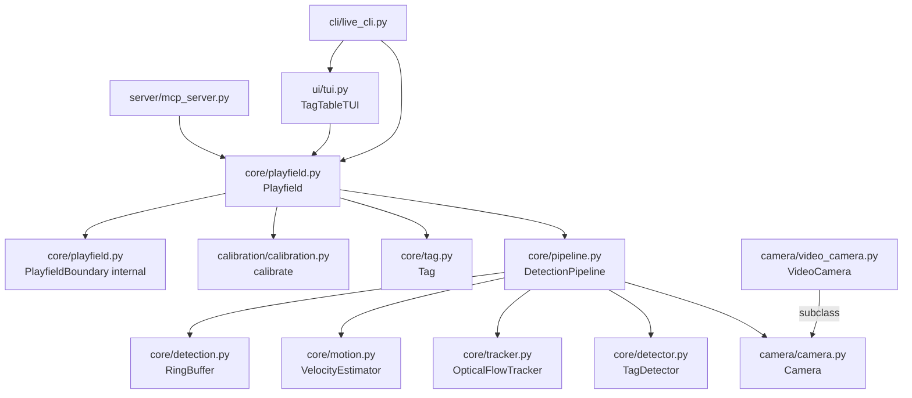
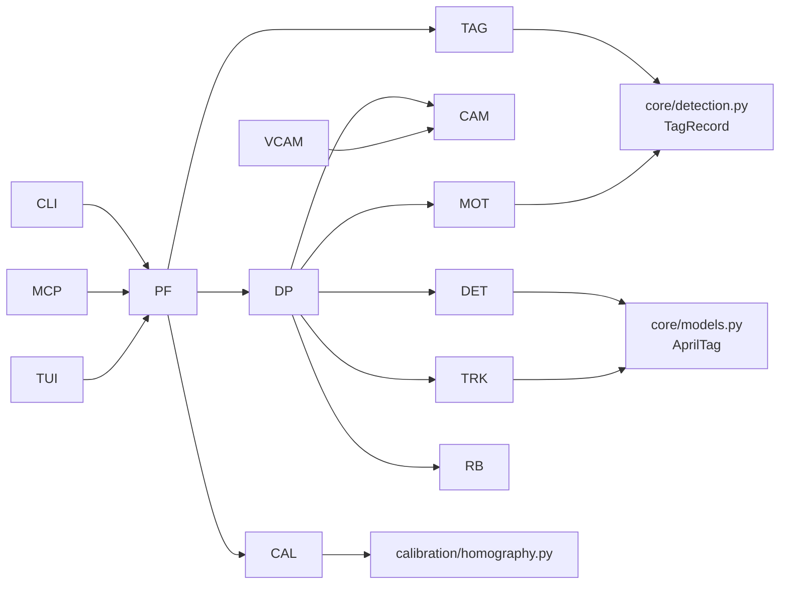
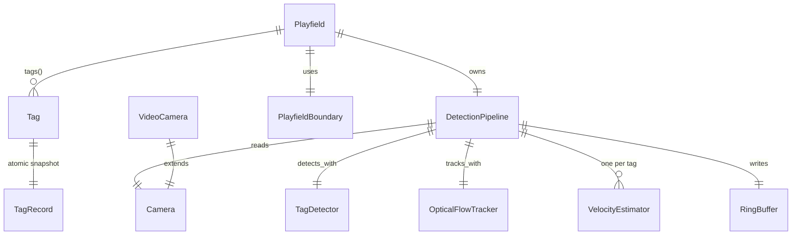

# Architecture Update -- Sprint 014: OOP Refactoring and Video-Based Test System

## What Changed

### New Modules

**`camera/camera.py` — `Camera`**
Wraps `cv.VideoCapture` with device metadata and discovery. Provides
`Camera.list() -> list[Camera]` and `Camera.find(pattern) -> Camera`.
Properties: `name`, `index`, `resolution`, `is_open`. Methods: `read()`,
`close()`, `__enter__`/`__exit__`. Delegates to existing `camutil` functions.
Boundary: owns the VideoCapture lifecycle; does not run detection.
Use cases: SUC-001, SUC-002.

**`camera/video_camera.py` — `VideoCamera(Camera)`**
Subclass of `Camera` that reads frames sequentially from a `.mov` file.
Same interface as `Camera`; `read()` returns `None` at EOF.
Boundary: file I/O only; no detection logic.
Use cases: SUC-002, SUC-010.

**`core/tag.py` — `Tag`**
User-facing live tag handle obtained from `Playfield`. Holds an
atomically-replaced frozen `TagRecord` snapshot. Flat properties: `id`,
`cx`, `cy`, `wx`, `wy`, `orientation`, `velocity`, `speed`, `heading`,
`rotation_rate`, `timestamp`, `age`, `is_visible`. Methods: `update()`,
`position_at(t)`, `to_dict()`.
Boundary: read-only view of the pipeline; no detection or threading.
Use cases: SUC-006, SUC-007.

**`core/detector.py` — `TagDetector`**
Pure stateless detection engine. `DetectorConfig` dataclass holds all
tuning parameters with sensible defaults. `detect(frame_bgr) -> list[Detection]`.
Absorbs `AprilCam._build_detectors()`, `_maybe_preprocess()`,
`detect_apriltags()`, and the duplicate module-level `build_detectors()` /
`detect_apriltags()` functions that currently exist alongside the class.
Boundary: takes a frame, returns detections; no state, no threading.
Use cases: SUC-003.

**`core/tracker.py` — `OpticalFlowTracker`**
LK optical flow tracker operating on 4 corners of each known tag. Produces
full per-tag motion decomposition: 2D translation, rotation rate (yaw delta),
and scale delta (z-axis proxy). `update(gray, detections_or_none) -> list[Detection]`.
When `detections_or_none` is not None, resets tracked points.
Absorbs `AprilCam.lk_track()` and the detect-or-track branching in
`process_frame()`.
Boundary: takes grayscale frames + detections; returns enriched detections.
Use cases: SUC-004.

**`core/motion.py` — `VelocityEstimator`**
Per-tag EMA velocity estimator with deadband suppression. `update(position, timestamp) -> (velocity_vec, speed)`. `predict_position(t) -> (x, y)`. Designed for future Kalman filter replacement.
Absorbs the velocity EMA block from `Playfield.add_tag()` and world-velocity
transform code from `aprilcam.py`.
Boundary: stateful per-tag math; no I/O, no threading.
Use cases: SUC-005.

**`core/pipeline.py` — `DetectionPipeline`**
Background thread orchestrating: Camera → TagDetector → OpticalFlowTracker →
VelocityEstimator → RingBuffer. Exposes `start()`, `stop()`, `is_running`,
`ring_buffer`, and `on_frame(callback)`.
Evolves from the existing `DetectionLoop` in `detection.py`.
Boundary: owns the background thread; delegates all detection/tracking to
composed objects.
Use cases: SUC-002, SUC-004, SUC-005, SUC-006, SUC-007.

**`ui/tui.py` — `TagTableTUI`**
Rich-based TUI dashboard. Reads tag data through the public `Playfield` / `Tag`
API only. Extracted from `AprilCam._build_tui_layout`, `_print_tui`,
`_stop_tui`, `_ema_smooth`.
Boundary: presentation only; no detection logic.
Use cases: SUC-008.

**`calibration/calibration.py` — calibration functions and types**
`calibrate()` function, `CameraCalibration` dataclass, `FieldSpec` split out
from `homography.py`. Pure math and coordinate-transform code stays in
`homography.py`. `calibration.py` owns the calibration workflow: detect
corners, compute homography, persist JSON.
Boundary: calibration I/O and workflow; pure math stays in `homography.py`.
Use cases: SUC-009.

**`tests/smoke/`**
Fast import and construction sanity checks. No hardware; no video.
Use cases: SUC-010.

**`tests/unit/`**
Per-class unit tests. Uses `VideoCamera` or mocks. No hardware.
Use cases: SUC-010.

**`tests/system/`**
Full pipeline tests using `tests/movies/*.mov` via `VideoCamera`.
Use cases: SUC-002, SUC-010.

---

### Modified Modules

**`core/playfield.py` — `Playfield` rewritten**
`Playfield` becomes the primary user-facing object. Constructor:
`Playfield(camera, *, width_cm=None, height_cm=None, family="tag36h11", calibration=None)`.
Owns a `DetectionPipeline`. Tag access: `tags() -> dict[int, Tag]`, `tag(id) -> Tag | None`.
Streaming: `stream() -> Generator[list[Tag]]`, `on_frame(callback)`.
Lifecycle: `start()`, `stop()`, `calibrate()`.
Geometry: `pixel_to_world()`, `world_to_pixel()`, `deskew()`.
The existing geometry/corner logic becomes `PlayfieldBoundary` (internal).
Use cases: SUC-006, SUC-007, SUC-009.

**`camera/__init__.py`**
Exports `Camera`, `VideoCamera`.

**`__init__.py`**
Adds exports: `Camera`, `Tag`, `calibrate`.
Deprecates: `detect_tags`, `detect_objects`, `AprilCam` (compatibility shim only).
`Playfield` export updated to point to rewritten class.

**`cli/live_cli.py`**
Absorbs `AprilCam.run()` interactive loop. Uses `Playfield` + `TagTableTUI`.

---

### Removed / Shrunk

**`stream.py`** — deleted. Its functions (`detect_tags`, `detect_objects`,
`calibrate`) are replaced by `Playfield` methods and `calibration.py`.
A thin compatibility re-export in `__init__.py` preserves the names during
transition.

**`core/aprilcam.py`** — shrunk to a thin compatibility shim. All logic
extracted to `TagDetector`, `OpticalFlowTracker`, `VelocityEstimator`,
`DetectionPipeline`, `Playfield`, `TagTableTUI`.

---

## Component Diagram

---

## Dependency Graph

No cycles. Dependency direction flows: CLI/MCP → Playfield → Pipeline →
Detector/Tracker/Estimator → Camera/Models. Infrastructure (Camera, VideoCamera)
has no upward dependencies.

---

## Entity-Relationship Diagram (Data Model)

---

## Why

`AprilCam` (1013 lines, 27 constructor params) violates the single-responsibility
principle: it owns camera I/O, tag detection, optical flow tracking, velocity
estimation, ring-buffer management, TUI rendering, and OpenCV window display.
This makes components untestable in isolation and tightly couples unrelated
concerns.

Extracting each responsibility to its own module:
- Enables unit testing without camera hardware (use `VideoCamera` or a mock frame).
- Reduces the surface each caller must understand.
- Allows the detection engine to be used without the full pipeline.
- Enables the TUI to be swapped or disabled without touching detection code.
- Aligns with the dependency direction: infrastructure at the bottom,
  domain logic in the middle, presentation at the top.

The video-based test system completes the picture: `VideoCamera` makes hardware
a plugin rather than a requirement, letting CI run the full pipeline against
known recordings.

---

## Impact on Existing Components

- `mcp_server.py` — continues to work through `AprilCam` compatibility shim
  during the sprint. Rewiring to `Playfield` is a subsequent sprint.
- `stream.py` — deleted, but `__init__.py` re-exports `detect_tags` / `detect_objects`
  pointing to `Playfield`-based implementations for backward compatibility.
- `cli/live_cli.py` — absorbs `AprilCam.run()`. Existing `aprilcam live`
  command works unchanged from the user's perspective.
- `core/detection.py` — `DetectionLoop` class is superseded by `DetectionPipeline`
  but not removed in this sprint (shim references it). `RingBuffer`, `TagRecord`,
  `FrameRecord` remain unchanged.
- `calibration/homography.py` — pure math functions remain; calibration workflow
  types and `calibrate()` move to `calibration/calibration.py`.

---

## Migration Concerns

All new classes are additive. `AprilCam` remains as a shim. `__init__.py`
exports expand rather than break. `stream.py` deletion is shadowed by
re-exports. No database migrations, no breaking MCP tool signatures.

Callers using `detect_tags()` directly will see identical behavior through
the compatibility layer. Callers using `AprilCam` directly will see a
deprecation path but no immediate breakage.

---

## Design Rationale

### PlayfieldBoundary as internal vs. public

**Decision**: Rename the existing `Playfield` geometry/corner class to
`PlayfieldBoundary` and make it internal.

**Context**: The existing `Playfield` is a geometry helper (corner detection,
polygon, velocity). The new `Playfield` is the user-facing object that owns
the whole pipeline.

**Alternatives considered**: Keep the name, compose differently.

**Why this choice**: Callers expect `Playfield` to be the top-level object.
Making the boundary class internal prevents name confusion and allows the
public interface to be designed cleanly.

**Consequences**: One internal rename; no public-facing break since the old
`Playfield` was not part of a stable public API.

---

### VideoCamera as Camera subclass vs. protocol/interface

**Decision**: `VideoCamera` subclasses `Camera` directly.

**Context**: Python's structural typing would allow a duck-typed approach, but
the test code needs `isinstance` checks in some pipeline branches.

**Alternatives considered**: `Protocol`-based `CameraLike`; separate ABC.

**Why this choice**: Subclassing is simpler, avoids protocol complexity, and
ensures `VideoCamera` inherits all lifecycle behavior. An ABC can be introduced
later if needed.

**Consequences**: If `Camera.__init__` acquires hardware-touching logic,
`VideoCamera.__init__` must override it. Kept manageable by design.

---

### VelocityEstimator designed for Kalman filter swap

**Decision**: `VelocityEstimator` exposes `update(position, timestamp)` and
`predict_position(t)` as the stable API, with EMA internals.

**Context**: The TODO explicitly calls out Kalman filter as a future upgrade.

**Why this choice**: Hiding the estimator implementation behind a stable
interface means swapping EMA for Kalman requires only changing the
`VelocityEstimator` class, not callers.

**Consequences**: Marginally more indirection; no measurable cost.

---

## Open Questions

1. Should `AprilCam` be fully deleted in this sprint or kept as a shim for
   one more sprint until `mcp_server.py` is rewired? (Recommendation: keep
   shim this sprint; delete next sprint.)

2. Should `stream.py` be deleted with compatibility re-exports in `__init__.py`,
   or soft-deprecated with deprecation warnings? (Recommendation: delete the
   file, re-export from `__init__.py` pointing to `Playfield` equivalents.)

3. Do the test system tests need to assert specific tag IDs (requiring someone
   to catalog the videos first), or just assert "at least one tag detected"?
   (Recommendation: assert at least one tag detected in each video on the first
   pass; add specific ID assertions in a follow-up sprint once catalogued.)
